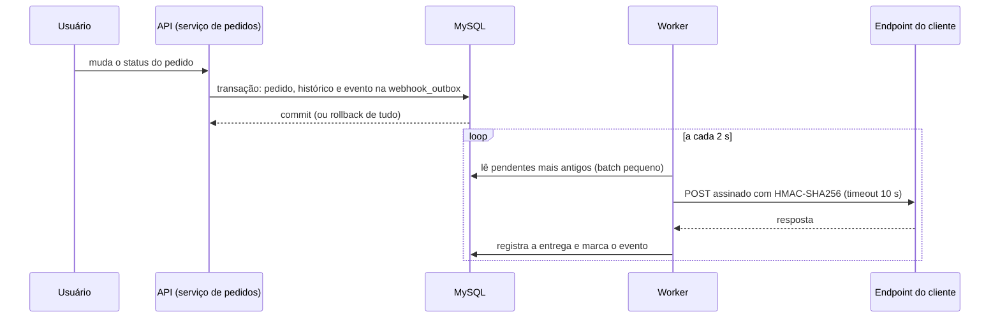
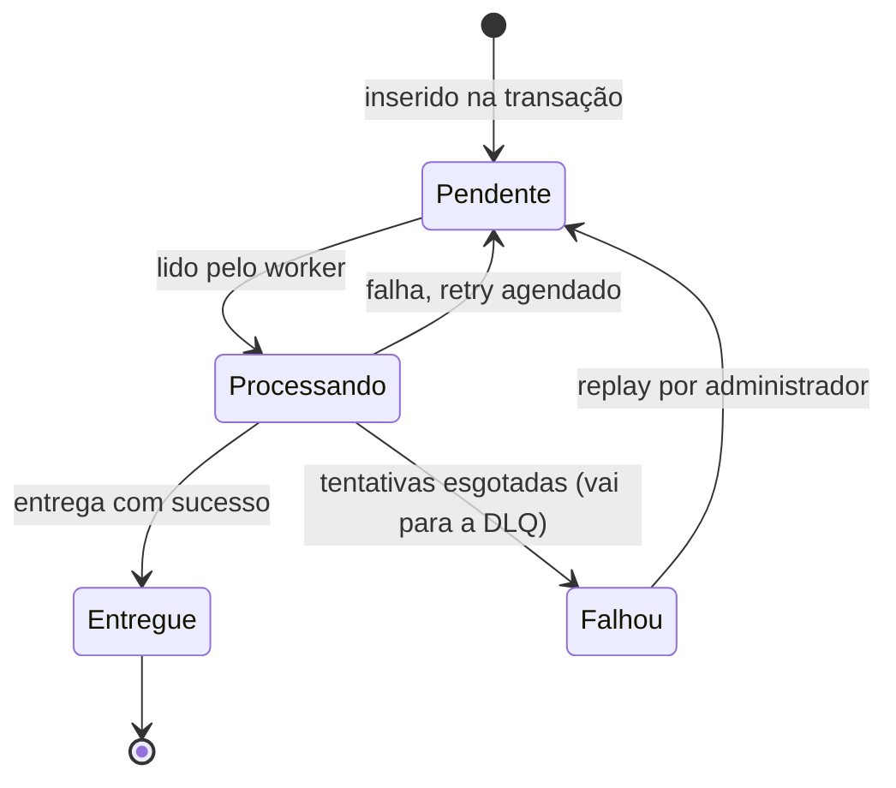

# FDD: Sistema de Webhooks de Notificação de Pedidos

Versão: 1.0 (em revisão)
Data: Reunião técnica de quinta-feira, 09:00 (ver [`TRANSCRICAO.md`](../TRANSCRICAO.md))
Responsável: Larissa (Tech Lead)
Documentos relacionados: [RFC](RFC.md), [ADRs](adrs/)

Convenção de fontes: `[hh:mm] Nome` aponta para a transcrição, e `caminho:linha` aponta para o código. Nada neste documento é hipótese: o que a reunião não definiu aparece como "Não definido na reunião".

## 1. Contexto e motivação técnica

Três clientes B2B precisam ser avisados de mudanças de status dos seus pedidos em menos de 10 segundos ([09:00] Marcos, [09:02] Marcos). A proposta e as alternativas estão no [RFC](RFC.md), e cada decisão está nas [ADRs](adrs/). Este documento descreve como implementar.

O ponto de disparo é o método de mudança de status do serviço de pedidos, que executa uma única transação: valida a transição, ajusta estoque, atualiza o pedido e grava o histórico (`src/modules/orders/order.service.ts:126-178`). A feature acrescenta a inserção do evento na outbox dentro dessa transação ([09:40] Bruno), um worker em processo separado que faz as chamadas HTTP ([09:06] Diego, [09:11] Diego) e um módulo novo no padrão do projeto ([09:27] Bruno).

**Atores**
- Usuário autenticado da API, que cadastra e gerencia webhooks; o customer vai no corpo ou no caminho da requisição, não vem do JWT ([09:32] Larissa).
- Administrador, o único que faz replay da DLQ ([09:36] Sofia).
- Worker de webhooks, processo separado que lê a outbox ([09:11] Diego).
- Endpoint do cliente, fora da infraestrutura da plataforma, que valida a origem e a integridade dos envios ([09:19] Sofia).

**Restrições**
- FDD-REST-01: Nada novo: reuso de `AppError`, Pino, error middleware, padrão de módulos, schemas Zod e códigos de erro ([09:29] Bruno, [09:30] Larissa).
- FDD-REST-02: Mesmo banco e mesma stack; o worker abre um `PrismaClient` próprio, com o mesmo `DATABASE_URL` ([09:11] Diego, [09:30] Bruno).
- FDD-REST-03: Um único worker; a ordem só vale por `order_id` e enquanto for single-worker ([09:13] Larissa).
- FDD-REST-04: URL do webhook obrigatoriamente `https` ([09:23] Sofia).
- FDD-REST-05: Payload de no máximo 64 KB, com erro se ultrapassar ([09:24] Larissa).

**Não definido na reunião**

Os pontos abaixo afetam a implementação e não foram definidos na reunião. Estão no [RFC, seção 5.2](RFC.md), e este FDD não escolhe por eles.
- Quais respostas HTTP, além da falta de resposta em 10 s, contam como falha.
- Se o replay mantém o identificador original do evento, e se a auditoria do replay é só em log.
- Como assinar durante as 24 h em que duas secrets são válidas.
- Se um evento enviado a dois webhooks do mesmo customer usa o mesmo identificador.
- O que acontece com os eventos pendentes de um webhook desativado ou removido.
- Como recuperar eventos presos em processamento quando o worker cai.
- Se a regra de `https` gera `VALIDATION_ERROR` (validação no schema, [09:23] Sofia) ou `WEBHOOK_INVALID_URL` ([09:28] Bruno).
- Se a criação do pedido, que grava o status inicial fora da mudança de status (`src/modules/orders/order.service.ts:58`), gera evento.

## 2. Objetivos técnicos

- FDD-OBJ-01 **Atomicidade:** se a transação principal commitou, o evento foi registrado; se deu rollback, o evento some junto ([09:06] Diego). Se a inserção na outbox falhar, a mudança de status sofre rollback ([09:40] Bruno).
- FDD-OBJ-02 **Latência:** o worker lê a outbox a cada 2 s; a latência é de 2 s no pior caso ([09:10] Larissa), dentro da meta de 10 s ([09:02] Marcos).
- FDD-OBJ-03 **Resiliência:** 5 retentativas com backoff de 1 min, 5 min, 30 min, 2 h e 12 h ([09:17] Larissa), quase 15 h entre a primeira falha e a última tentativa ([09:17] Diego).
- FDD-OBJ-04 **Autenticidade:** HMAC-SHA256 sobre o corpo, com secret por endpoint ([09:22] Sofia).
- FDD-OBJ-05 **Deduplicação:** UUID gerado quando o evento entra na outbox, único por evento, enviado em `X-Event-Id` ([09:25] Diego) e no payload ([09:43] Diego).
- FDD-OBJ-06 **Ordem:** com um único worker, o processamento segue a ordem de `created_at` da outbox ([09:12] Diego).
- FDD-OBJ-07 **Consistência:** erros com o prefixo `WEBHOOK_` ([09:29] Larissa), no envelope do error middleware existente (`src/middlewares/error.middleware.ts:14-23`).

## 3. Escopo e exclusões

**Incluído**
- Inserção na outbox dentro da transação de mudança de status ([09:40] Bruno), com filtro na inserção ([09:34] Bruno) e payload renderizado na inserção ([09:52] Larissa).
- Worker em polling de 2 s ([09:10] Larissa), com retry e backoff e DLQ em tabela separada ([09:17] Larissa, [09:18] Diego).
- Cadastro (POST), edição (PATCH), remoção (DELETE) e listagem por customer (GET) de webhooks ([09:31] Marcos, [09:33] Bruno).
- Rotação de secret pela API, com carência de 24 h ([09:21] Sofia).
- Histórico de entregas por webhook ([09:34] Marcos).
- Replay manual da DLQ, com papel `ADMIN` e log de quem fez ([09:18] Diego, [09:36] Sofia).

**Excluído**
- Webhooks de entrada ([09:02] Marcos).
- E-mail em falhas seguidas ([09:37] Larissa).
- Rate limiting de saída, em observação ([09:39] Larissa).
- Painel visual ([09:40] Larissa).
- Arquivamento de eventos entregues ([09:08] Diego).
- Vários workers ([09:13] Diego).

## 4. Fluxos detalhados e diagramas

**Fluxo principal**
1. Um usuário muda o status de um pedido pela rota existente (`src/modules/orders/order.routes.ts:19-23`).
2. Dentro da transação, o serviço de pedidos chama `publishWebhookEvent(tx, order, fromStatus, toStatus)` com o client da transação atual ([09:41] Bruno), depois de gravar o histórico (`src/modules/orders/order.service.ts:159-167`).
3. A função verifica se algum webhook do customer quer aquele status; se nenhum quer, nem insere ([09:34] Bruno).
4. Se houver, insere na `webhook_outbox` o evento ([09:06] Diego), com UUID ([09:51] Larissa) e o payload já renderizado ([09:52] Larissa, [09:52] Diego), com status pendente ([09:08] Diego). Se a inserção falhar, a transação sofre rollback ([09:40] Bruno).
5. A cada 2 s, o worker busca os eventos pendentes mais antigos, em batch pequeno ([09:08] Diego, [09:09] Diego).
6. Para cada evento, o worker assina o corpo com HMAC-SHA256 e a secret do endpoint ([09:22] Sofia) e faz a chamada HTTP, com timeout de 10 s ([09:42] Diego).
7. O worker registra a entrega no histórico: sucesso ou falha, payload, response e tempo de resposta ([09:34] Marcos).
8. O worker marca o evento como entregue ([09:08] Diego, [09:09] Diego). Quais respostas contam como sucesso: não definido na reunião.

**Fluxos alternativos e exceções**
- **Falha ou timeout:** o cliente que não responde em 10 s é tratado como falha e marcado para retry ([09:42] Diego), no próximo intervalo da progressão de 1 min, 5 min, 30 min, 2 h e 12 h ([09:17] Diego).
- **Tentativas esgotadas:** depois do teto, o evento é falha permanente e vai para a DLQ ([09:15] Diego), a `webhook_dead_letter`, com o payload, o motivo da falha e o timestamp ([09:18] Diego).
- **Payload acima de 64 KB:** "a gente não envia" ([09:23] Sofia), e ocorre erro ([09:24] Larissa). Onde o erro é registrado: não definido na reunião.
- **Replay:** um administrador faz o replay de um evento da DLQ, que é recolocado na outbox como pendente ([09:18] Diego); o sistema loga quem fez ([09:36] Sofia).
- **Rotação de secret:** o cliente pede uma nova secret pela API; a antiga fica válida por 24 h em paralelo e depois deixa de valer ([09:21] Sofia).

**Diagrama de sequência: do status à entrega**



**Diagrama de estados do evento na outbox**

Os quatro estados são os citados em [09:08] Diego: pendente, processando, falhou e entregue.



**Modelo de dados (resumo)**

As tabelas seguem o padrão do schema: identificador UUID em `Char(36)` ([09:51] Larissa, `prisma/schema.prisma:26`), `@@index` e `@@map` (`prisma/schema.prisma:116-131`).

| Tabela | Conteúdo definido na reunião | Fonte |
| --- | --- | --- |
| Configuração de webhook (nome não definido na reunião) | URL, secret, customer, estado ativo e lista de status que o webhook quer ouvir; para a rotação, também a secret antiga até o fim da carência de 24 h | [09:21] Bruno, [09:21] Sofia, [09:33] Marcos |
| `webhook_outbox` | Evento com UUID (`event_id`), payload renderizado, status (pendente, processando, falhou, entregue) e `created_at`, com índice em status e em `created_at` | [09:06] Diego, [09:08] Diego, [09:25] Diego, [09:52] Larissa |
| `webhook_dead_letter` | Payload, motivo da falha e timestamp | [09:18] Diego |
| Histórico de entregas (nome não definido na reunião) | Por entrega: sucesso ou falha, payload, response e tempo de resposta | [09:34] Marcos |

Como a outbox registra o número de tentativas e o horário da próxima: não definido na reunião.

**Parâmetros e defaults**

| ID | Parâmetro | Valor | Fonte |
| --- | --- | --- | --- |
| FDD-PARAM-01 | Intervalo de polling | 2 s | [09:10] Larissa |
| FDD-PARAM-02 | Tamanho do lote | "batch pequeno"; o número não foi definido na reunião | [09:08] Diego |
| FDD-PARAM-03 | Timeout da chamada | 10 s | [09:42] Diego |
| FDD-PARAM-04 | Retentativas e intervalos | 5: 1 min, 5 min, 30 min, 2 h, 12 h | [09:17] Larissa |
| FDD-PARAM-05 | Tamanho máximo do payload | 64 KB | [09:24] Larissa |
| FDD-PARAM-06 | Carência da secret antiga | 24 h | [09:21] Sofia |
| FDD-PARAM-07 | Tipo do evento | `order.status_changed` | [09:43] Diego |
| FDD-PARAM-08 | Itens do histórico | últimos 100 | [09:34] Marcos |

## 5. Contratos públicos (assinaturas, endpoints, headers, exemplos)

As rotas ficam sob `/api/v1` (`src/app.ts:67`), com autenticação JWT (`src/middlewares/auth.middleware.ts:27`); os endpoints de configuração são "autenticados normal" ([09:48] Larissa). O recurso é `/webhooks`, como na rota de histórico citada em [09:34] Marcos. Os status HTTP de sucesso seguem a convenção dos controllers existentes: 201 ao criar, 200 ao ler ou alterar e 204 ao remover (`src/modules/customers/customer.controller.ts:12-48`). Erros usam o envelope do error middleware (`src/middlewares/error.middleware.ts:16-22`). Os corpos usam camelCase, como o resto da API (`tests/orders.test.ts`); os nomes dos campos traduzem os termos da reunião.

### FDD-CONTRATO-01: Cadastrar webhook
- Tipo: endpoint
- Assinatura/Rota: `/api/v1/webhooks`
- Método: POST ([09:31] Marcos)
- Semântica de status/headers:
  - 201: webhook criado; a secret é gerada pela plataforma e devolvida na criação ([09:31] Marcos).
  - 400: URL `http` recusada com erro de validação ([09:23] Sofia); o código exato está em aberto (seção 1).
- Fonte: [09:31] Marcos, [09:32] Larissa, [09:33] Marcos

**Exemplo de requisição**
```json
{
  "customerId": "5b1f8f2e-9a4c-4c3e-8d2a-1f0e6b7c9a10",
  "url": "https://cliente.exemplo.com/webhooks/pedidos",
  "events": ["SHIPPED", "DELIVERED"]
}
```

**Exemplo de resposta**
```json
{
  "id": "9d3c2b1a-7e6f-4a5b-9c8d-0e1f2a3b4c5d",
  "customerId": "5b1f8f2e-9a4c-4c3e-8d2a-1f0e6b7c9a10",
  "url": "https://cliente.exemplo.com/webhooks/pedidos",
  "events": ["SHIPPED", "DELIVERED"],
  "active": true,
  "secret": "<secret gerada pela plataforma>"
}
```

### FDD-CONTRATO-02: Listar webhooks de um customer
- Tipo: endpoint
- Assinatura/Rota: `/api/v1/webhooks?customerId={uuid}`
- Método: GET ([09:33] Bruno)
- Semântica de status/headers:
  - 200: webhooks do customer, no formato paginado da API (`src/shared/http/response.ts:22-24`).
- Fonte: [09:33] Bruno

**Exemplo de requisição**
```json
{}
```
(sem corpo; o customer vai na query string)

**Exemplo de resposta**
```json
{
  "data": [
    {
      "id": "9d3c2b1a-7e6f-4a5b-9c8d-0e1f2a3b4c5d",
      "customerId": "5b1f8f2e-9a4c-4c3e-8d2a-1f0e6b7c9a10",
      "url": "https://cliente.exemplo.com/webhooks/pedidos",
      "events": ["SHIPPED", "DELIVERED"],
      "active": true
    }
  ],
  "pagination": { "page": 1, "pageSize": 20, "total": 1, "totalPages": 1 }
}
```

### FDD-CONTRATO-03: Editar webhook
- Tipo: endpoint
- Assinatura/Rota: `/api/v1/webhooks/{id}`
- Método: PATCH ([09:33] Bruno)
- Semântica de status/headers:
  - 200: webhook atualizado; por endpoint dá para escolher quais eventos receber ([09:33] Bruno), além da URL e do estado ativo ([09:21] Bruno).
  - 404 `WEBHOOK_NOT_FOUND` ([09:28] Bruno).
- Fonte: [09:33] Bruno

**Exemplo de requisição**
```json
{ "events": ["PAID", "SHIPPED", "DELIVERED"] }
```

**Exemplo de resposta**
```json
{
  "id": "9d3c2b1a-7e6f-4a5b-9c8d-0e1f2a3b4c5d",
  "customerId": "5b1f8f2e-9a4c-4c3e-8d2a-1f0e6b7c9a10",
  "url": "https://cliente.exemplo.com/webhooks/pedidos",
  "events": ["PAID", "SHIPPED", "DELIVERED"],
  "active": true
}
```

### FDD-CONTRATO-04: Remover webhook
- Tipo: endpoint
- Assinatura/Rota: `/api/v1/webhooks/{id}`
- Método: DELETE ([09:33] Bruno)
- Semântica de status/headers:
  - 204: webhook removido.
  - 404 `WEBHOOK_NOT_FOUND` ([09:28] Bruno).
- Fonte: [09:33] Bruno

**Exemplo de requisição**
```json
{}
```
(sem corpo)

**Exemplo de resposta**
```json
{}
```
(204, sem corpo)

### FDD-CONTRATO-05: Rotacionar secret
- Tipo: endpoint
- Assinatura/Rota: a reunião definiu o endpoint ("Endpoint pro cliente conseguir pedir nova secret pela API", [09:21] Sofia), mas não a rota
- Método: não definido na reunião
- Semântica de status/headers:
  - Sucesso: nova secret devolvida; a antiga fica válida por 24 h em paralelo e depois deixa de valer ([09:21] Sofia).
  - 404 `WEBHOOK_NOT_FOUND` ([09:28] Bruno).
- Fonte: [09:21] Sofia

**Exemplo de requisição**
```json
{}
```
(sem corpo)

**Exemplo de resposta**
```json
{ "secret": "<nova secret gerada pela plataforma>" }
```

### FDD-CONTRATO-06: Histórico de entregas
- Tipo: endpoint
- Assinatura/Rota: `/api/v1/webhooks/{id}/deliveries` ([09:34] Marcos)
- Método: GET
- Semântica de status/headers:
  - 200: últimos 100 webhooks enviados, com sucesso ou falha, payload, response e tempo de resposta ([09:34] Marcos).
  - 404 `WEBHOOK_NOT_FOUND` ([09:28] Bruno).
- Fonte: [09:34] Marcos

**Exemplo de requisição**
```json
{}
```
(sem corpo)

**Exemplo de resposta**
```json
{
  "data": [
    {
      "success": true,
      "payload": { "event_id": "0f8e7d6c-5b4a-4938-8271-6a5b4c3d2e1f", "event_type": "order.status_changed" },
      "response": "{\"received\":true}",
      "responseTimeMs": 184
    }
  ]
}
```

### FDD-CONTRATO-07: Replay de evento da DLQ
- Tipo: endpoint
- Assinatura/Rota: `/api/v1/admin/webhooks/dead-letter/{id}/replay` ([09:35] Diego, com o prefixo de `src/app.ts:67`)
- Método: POST ([09:35] Diego)
- Semântica de status/headers:
  - 200: evento recolocado na outbox como pendente ([09:18] Diego); 200 segue a convenção de alteração dos controllers (`src/modules/orders/order.controller.ts:42`).
  - 403 `FORBIDDEN`: usuário sem role `ADMIN` ([09:36] Sofia, `src/middlewares/auth.middleware.ts:49-61`).
- Fonte: [09:18] Diego, [09:35] Diego, [09:36] Sofia

**Exemplo de requisição**
```json
{}
```
(sem corpo)

**Exemplo de resposta**
```json
{ "event_id": "0f8e7d6c-5b4a-4938-8271-6a5b4c3d2e1f", "status": "pendente" }
```

### FDD-CONTRATO-08: Envio ao cliente (saída do worker)
- Tipo: endpoint (chamada que o worker faz à URL cadastrada)
- Assinatura/Rota: URL cadastrada no webhook
- Método: POST ([09:06] Diego: o worker fica "disparando as chamadas HTTP")
- Semântica de status/headers ([09:44] Diego, [09:44] Sofia):
  - `Content-Type: application/json`.
  - `X-Event-Id`: o UUID do evento.
  - `X-Signature`: o HMAC-SHA256 do corpo ([09:20] Sofia, [09:22] Sofia). Formato da assinatura: não definido na reunião.
  - `X-Timestamp`: o timestamp do envio, para o cliente conseguir detectar replay attack se quiser.
  - `X-Webhook-Id`: o id do endpoint, para o cliente que tem vários saber qual cadastro caiu naquele envio.
  - Sem resposta em 10 s: falha e retry ([09:42] Diego). Demais respostas: não definido na reunião.
- Fonte: [09:43] Diego, [09:44] Diego, [09:44] Sofia

**Exemplo de requisição**

Campos de [09:43] Diego, em snake_case como ele os citou. Os itens do pedido não vão, "pra não inflar".
```json
{
  "event_id": "0f8e7d6c-5b4a-4938-8271-6a5b4c3d2e1f",
  "event_type": "order.status_changed",
  "timestamp": "2026-09-24T12:05:00.000Z",
  "order_id": "3c2b1a09-8f7e-4d6c-9b5a-4e3d2c1b0a9f",
  "order_number": "ORD-000123",
  "from_status": "PROCESSING",
  "to_status": "SHIPPED",
  "customer_id": "5b1f8f2e-9a4c-4c3e-8d2a-1f0e6b7c9a10",
  "total_cents": 18000
}
```

**Exemplo de resposta**
```json
{}
```
(o conteúdo da resposta do cliente não foi definido na reunião; ele é guardado no histórico como "response", [09:34] Marcos)

### FDD-CONTRATO-09: Função de publicação (interna)
- Tipo: function
- Assinatura/Rota: `publishWebhookEvent(tx, order, fromStatus, toStatus)` ([09:41] Bruno)
- Método: não se aplica
- Semântica de status/headers:
  - Aceita o tx client da transação atual, e o serviço de pedidos a chama ([09:41] Bruno); o tipo do client transacional já existe (`src/modules/orders/order.service.ts:24`).
  - "função pura recebendo o tx", sem injetar repository inteiro ([09:41] Diego).
  - Se a inserção falhar, rollback da mudança de status ([09:40] Bruno).
- Fonte: [09:41] Bruno, [09:41] Diego

**Exemplo de requisição**
```json
{ "fromStatus": "PROCESSING", "toStatus": "SHIPPED" }
```
(representação dos argumentos de status; `tx` e `order` são objetos em memória)

**Exemplo de resposta**
```json
{}
```
(sem retorno; o efeito é a linha na outbox dentro da transação)

## 6. Erros, exceções e fallback

### 6.1 Matriz de erros previstos

Os códigos são os citados na reunião, com o prefixo `WEBHOOK_` para tudo do módulo ([09:28] Bruno, [09:29] Larissa). A lista de Bruno não é fechada (termina com etc.), mas outros códigos não foram definidos na reunião.

| ID | Código | HTTP | Condição | Tratamento | Fonte |
| --- | --- | --- | --- | --- | --- |
| FDD-ERRO-01 | `WEBHOOK_NOT_FOUND` | 404 | Webhook inexistente | Classe derivada de `AppError`, porque `NotFoundError` fixa o código `NOT_FOUND` (`src/shared/errors/http-errors.ts:27-31`) | [09:28] Bruno |
| FDD-ERRO-02 | `WEBHOOK_INVALID_URL` | 400 | URL inválida; se inclui a URL `http`, depende da questão em aberto da seção 1 | Pode usar `BadRequestError`, que aceita código (`src/shared/errors/http-errors.ts:3-7`) | [09:28] Bruno, [09:23] Sofia |
| FDD-ERRO-03 | `WEBHOOK_SECRET_REQUIRED` | Não definido na reunião | Não definida na reunião | Não definido na reunião | [09:28] Bruno |

**Outros erros previstos, sem código definido na reunião**
- URL `http`: "recusamos com erro de validação" ([09:23] Sofia).
- Payload acima de 64 KB: não envia, e ocorre erro ([09:23] Sofia, [09:24] Larissa).
- Cliente sem resposta em 10 s: falha, com retry ([09:42] Diego).
- Replay sem role `ADMIN`: `FORBIDDEN` (403) do `requireRole` existente ([09:36] Larissa, `src/middlewares/auth.middleware.ts:55-57`).
- Corpo inválido nas rotas: `VALIDATION_ERROR` (400) do middleware de validação (`src/middlewares/validate.middleware.ts:31`).

### 6.2 Estratégias de resiliência
- **Timeout:** 10 s por chamada ([09:42] Diego).
- **Retries com backoff exponencial:** 5 tentativas, em 1 min, 5 min, 30 min, 2 h e 12 h ([09:17] Larissa), quase 15 h entre a primeira falha e a última tentativa ([09:17] Diego).
- **DLQ:** depois do teto, falha permanente e DLQ ([09:15] Diego), em tabela separada ([09:18] Diego).
- **Circuit breaker:** não definido na reunião.

### 6.3 Política de fallback
- Sem aviso proativo ao cliente nesta fase: e-mail fica para uma próxima fase ([09:37] Larissa).
- Reprocessamento manual por endpoint admin ([09:18] Diego).

### 6.4 Invariantes
- Status mudou, evento existe; rollback, evento some: "Não tem inconsistência possível" ([09:06] Diego).
- "Não pode ter caso de status mudar e evento não sair" ([09:40] Bruno).
- O evento reflete o estado de quando o status mudou, mesmo que o pedido mude depois ([09:52] Larissa).
- No máximo 6 chamadas por evento antes da DLQ: o envio inicial e 5 retentativas ([09:17] Diego).

## 7. Observabilidade

A reunião não definiu métricas nem tracing. Esta seção registra o que a reunião definiu e o que o código já oferece.

**Métricas**
- Métricas: não definidas na reunião.
- Os dados que a reunião definiu permitem medir: o tempo de resposta e o resultado de cada entrega, guardados no histórico ([09:34] Marcos); a meta de entrega em menos de 10 s ([09:02] Marcos); e o volume por cliente, que o time vai "observar" antes de decidir sobre rate limiting ([09:39] Larissa).
- A API já registra, por requisição, o status HTTP e a duração em milissegundos (`src/middlewares/request-logger.middleware.ts:12-24`).

**Logs**
- Logger Pino já existente, sem nada novo ([09:29] Bruno), com JSON estruturado e campos base fixos (`src/shared/logger/index.ts:13-30`).
- O replay loga quem fez, para auditoria ([09:36] Sofia).
- A lista de campos mascarados cobre senhas e tokens, mas não secrets (`src/shared/logger/index.ts:4-11`). O mascaramento da secret não foi definido na reunião.

**Tracing**
- Tracing: não definido na reunião.
- Identificadores de correlação existentes: o `X-Request-Id` gerado por requisição (`src/middlewares/request-logger.middleware.ts:6-8`), o `event_id`, que vai no header `X-Event-Id` e no payload ([09:25] Diego, [09:43] Diego), e o `X-Webhook-Id` ([09:44] Sofia).

**Dashboards e alertas**
- Não definidos na reunião.

## 8. Dependências e compatibilidade

**Dependências**
- Node.js 20 ou superior (`package.json:8`), sem biblioteca nova ([09:29] Bruno).
- MySQL 8.0 existente (`docker-compose.yml:3`) e Prisma 5.22.0 (`package.json:26`), com o mesmo banco ([09:07] Diego).
- Express, Zod, Pino e uuid, já no projeto (`package.json:28-33`).
- Revisão de segurança de pelo menos dois dias úteis antes do deploy ([09:46] Sofia).

**Garantias de compatibilidade**
- O middleware de erro "Vai pegar nossos erros sem precisar mudar nada" ([09:29] Bruno).
- A alteração no código existente é dentro do service de orders, no `changeStatus` ([09:40] Bruno); a rota de mudança de status não muda (`src/modules/orders/order.routes.ts:19-23`).

## 9. Critérios de aceite técnicos

Os testes seguem o padrão atual, com Vitest e Supertest contra a API (`tests/orders.test.ts`, `package.json:17`). Os testes ponta a ponta estão na estimativa ([09:46] Larissa).

- [ ] FDD-CA-01: mudar o status para um status que um webhook do customer quer ouvir insere o evento na outbox na mesma transação ([09:40] Bruno).
- [ ] FDD-CA-02: se nenhum webhook do customer quer o status, nada é inserido ([09:34] Bruno).
- [ ] FDD-CA-03: se a inserção na outbox falhar, a mudança de status sofre rollback ([09:40] Bruno).
- [ ] FDD-CA-04: o evento é entregue em menos de 10 s após a mudança de status ([09:02] Marcos).
- [ ] FDD-CA-05: o envio traz `X-Event-Id`, `X-Signature`, `X-Timestamp`, `X-Webhook-Id` e `Content-Type` ([09:44] Diego, [09:44] Sofia), e a assinatura HMAC-SHA256 do corpo confere com a secret do endpoint ([09:22] Sofia).
- [ ] FDD-CA-06: uma entrega que sempre falha é retentada 5 vezes, em 1 min, 5 min, 30 min, 2 h e 12 h, e termina na DLQ com payload, motivo e timestamp ([09:17] Larissa, [09:18] Diego).
- [ ] FDD-CA-07: um cliente que não responde em 10 s conta como falha e vai para retry ([09:42] Diego).
- [ ] FDD-CA-08: o replay exige role `ADMIN`, recoloca o evento na outbox como pendente e loga quem fez ([09:18] Diego, [09:36] Sofia).
- [ ] FDD-CA-09: uma URL `http` é recusada com erro de validação ([09:23] Sofia).
- [ ] FDD-CA-10: depois de uma rotação, a secret antiga fica válida por 24 h e depois deixa de valer ([09:21] Sofia).
- [ ] FDD-CA-11: um payload acima de 64 KB não é enviado ([09:23] Sofia, [09:24] Larissa).
- [ ] FDD-CA-12: o histórico devolve os últimos 100 envios, com sucesso ou falha, payload, response e tempo de resposta ([09:34] Marcos).
- [ ] FDD-CA-13: com um único worker, os eventos de um pedido são entregues na ordem de `created_at` ([09:12] Diego).
- [ ] FDD-CA-14: os códigos de erro do módulo têm o prefixo `WEBHOOK_` ([09:29] Larissa).

## 10. Riscos e mitigação

### FDD-RISCO-01: A transação de mudança de status fica mais pesada
- Impacto: a transação "hoje já é pesada" ([09:04] Bruno) e passa a incluir a inserção na outbox ([09:40] Bruno).
- Mitigação:
  - Filtrar na inserção: se nenhum webhook quer aquele status, nem insere ([09:34] Bruno).
- Plano de contingência: não definido na reunião.
- Fonte: [09:04] Bruno

### FDD-RISCO-02: O cliente recebe o mesmo evento duas vezes
- Impacto: at-least-once; "Pode acontecer de o cliente receber o mesmo evento duas vezes" ([09:24] Diego).
- Mitigação:
  - `X-Event-Id` para o cliente deduplicar do lado dele ([09:25] Diego).
  - Documentação em destaque no portal ([09:26] Marcos).
- Plano de contingência: não definido na reunião.
- Fonte: [09:24] Diego, [09:25] Sofia

### FDD-RISCO-03: Vazamento de secret
- Impacto: "A gente já teve cliente que vazou secret em log de aplicação dele uma vez" ([09:22] Diego).
- Mitigação:
  - Secret única por endpoint ([09:21] Sofia).
  - Revisão de segurança de HMAC e geração de secret antes do deploy ([09:46] Sofia).
- Plano de contingência: rotação, com a antiga válida por 24 h ([09:21] Sofia).
- Fonte: [09:22] Diego

### FDD-RISCO-04: Autorização frouxa no cadastro e no replay
- Impacto:
  - O CRUD de configuração pode ser usado por qualquer role autenticada ([09:37] Sofia), e não há vínculo entre usuário e customer no schema (`prisma/schema.prisma:25-54`).
  - O registro de usuário aceita o papel `ADMIN` no corpo (`src/modules/auth/auth.schemas.ts:7`), em rota pública (`src/modules/auth/auth.routes.ts:10`), o que enfraquece a restrição do replay.
- Mitigação:
  - Replay com role `ADMIN` obrigatório, reaproveitando o `requireRole` ([09:36] Larissa), e log de quem fez ([09:36] Sofia).
- Plano de contingência: "Mais pra frente a gente pode endurecer." ([09:37] Sofia).
- Fonte: [09:37] Sofia

### FDD-RISCO-05: Rajada de chamadas para um cliente
- Impacto: "Se o cliente tem 50 pedidos mudando de status em um minuto, a gente bombardeia ele com 50 chamadas?" ([09:38] Diego).
- Mitigação:
  - Observar e decidir depois ([09:39] Larissa).
- Plano de contingência: implementar "se virar problema" ([09:39] Diego).
- Fonte: [09:38] Diego

## 11. Integração com o sistema existente

### FDD-INT-01: `src/modules/orders/order.service.ts`
- O que existe hoje: a mudança de status numa transação (linhas 126-178), com a gravação do histórico nas linhas 159-167 e o tipo do client transacional na linha 24.
- O que muda: "a alteração crítica é dentro do service de orders, no método changeStatus": a inserção na `webhook_outbox` dentro da mesma transação, com rollback se falhar ([09:40] Bruno), por meio de `publishWebhookEvent(tx, order, fromStatus, toStatus)`, chamada pelo serviço ([09:41] Bruno). Como a função chega ao serviço: não definido na reunião.

### FDD-INT-02: `src/app.ts` e `src/routes/index.ts`
- O que existe hoje: composição manual dos módulos (`src/app.ts:26-53`), rotas sob `/api/v1` (`src/app.ts:67`) e a montagem dos routers por módulo (`src/routes/index.ts:21-31`).
- O que muda: o módulo `src/modules/webhooks` entra com controller, service, repository, routes e schemas, como os demais ([09:27] Bruno), com as rotas `/webhooks` ([09:34] Marcos) e `/admin/webhooks/dead-letter/:id/replay` ([09:35] Diego).

### FDD-INT-03: `src/server.ts` e o novo `src/worker.ts`
- O que existe hoje: o único entry point (`src/server.ts:6`), com desligamento gracioso (`src/server.ts:13-21`).
- O que muda: "Tipo o que a gente já tem em src/server.ts, criar um src/worker.ts" ([09:11] Larissa), com a lógica de processamento dentro do módulo, em `webhook.worker.ts` ou `webhook.processor.ts` ([09:28] Bruno).

### FDD-INT-04: `package.json`
- O que existe hoje: scripts que apontam só para o servidor (`package.json:10-21`).
- O que muda: um script "npm run worker" ([09:11] Larissa).

### FDD-INT-05: `src/config/database.ts`
- O que existe hoje: a fábrica do `PrismaClient` (`src/config/database.ts:4`).
- O que é reutilizado: o worker cria uma instância nova, "porque é outro processo Node", com a mesma `DATABASE_URL` ([09:30] Bruno).

### FDD-INT-06: `src/shared/errors/app-error.ts` e `src/shared/errors/http-errors.ts`
- O que existe hoje: a classe base `AppError` (`app-error.ts:3`), classes que aceitam código (`http-errors.ts:3`, `:33`, `:39`) e `NotFoundError`, com código fixo (`http-errors.ts:27`).
- O que é reutilizado: "Tem classe AppError, classes específicas tipo InsufficientStockError [...] Quero seguir igual pra webhook" ([09:28] Bruno).

### FDD-INT-07: `src/middlewares/error.middleware.ts`
- O que existe hoje: o tratamento centralizado de `AppError`, Zod e Prisma (`error.middleware.ts:14-54`).
- O que é reutilizado: sem mudança ([09:29] Bruno).

### FDD-INT-08: `src/middlewares/auth.middleware.ts` e `src/modules/users/user.routes.ts`
- O que existe hoje: `authenticate` (`auth.middleware.ts:27`) e `requireRole` (`auth.middleware.ts:49`), usado hoje com `ADMIN` na rota de usuários (`user.routes.ts:15`).
- O que é reutilizado: "role ADMIN obrigatório no replay e a gente reaproveita o requireRole que já existe" ([09:36] Larissa).

### FDD-INT-09: `src/shared/logger/index.ts`
- O que existe hoje: o logger Pino (`src/shared/logger/index.ts:13-30`), com a lista de campos mascarados nas linhas 4-11.
- O que é reutilizado: o logger, sem nada novo ([09:29] Bruno), para o log de quem fez o replay ([09:36] Sofia).

### FDD-INT-10: `prisma/schema.prisma`
- O que existe hoje: identificadores UUID em `Char(36)` (linha 26) e o histórico de status como padrão de tabela de registro (linhas 116-131).
- O que muda: as tabelas `webhook_outbox` ([09:06] Diego) e `webhook_dead_letter` ([09:18] Diego), a configuração de webhook ([09:21] Bruno) e o histórico de entregas ([09:34] Marcos), com UUID ([09:51] Larissa).
