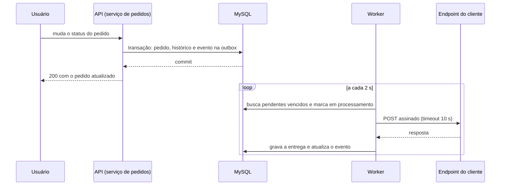
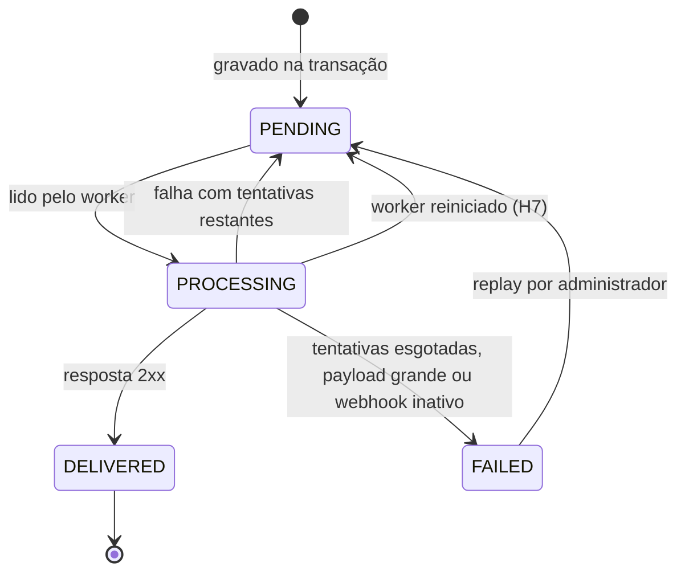

# FDD: Sistema de Webhooks de Notificação de Pedidos

Versão: 1.0 (em revisão)
Data: Reunião técnica de quinta-feira, 09:00 (ver [`TRANSCRICAO.md`](../TRANSCRICAO.md))
Responsável: Larissa (Tech Lead)
Documentos relacionados: [RFC](RFC.md), [ADRs](adrs/)

Convenção de fontes: `[hh:mm] Nome` aponta para a transcrição, e `caminho:linha` aponta para o código. O que não tem nenhuma das duas origens está marcado como **(hipótese)** e listado na seção 1.

## 1. Contexto e motivação técnica

Três clientes B2B precisam ser avisados de mudanças de status dos seus pedidos em menos de 10 segundos ([09:02] Marcos). A proposta e as alternativas estão no [RFC](RFC.md), e cada decisão está nas [ADRs](adrs/). Este documento descreve como implementar.

O ponto de disparo é o método de mudança de status do serviço de pedidos, que executa uma única transação: valida a transição, ajusta estoque, atualiza o pedido e grava o histórico (`src/modules/orders/order.service.ts:126-178`). A feature acrescenta a gravação de um evento nessa transação ([ADR-001](adrs/ADR-001-outbox-transacional-no-mysql.md)), um processo separado que entrega os eventos ([ADR-002](adrs/ADR-002-worker-em-processo-separado-com-polling.md)) e um módulo novo para configuração, histórico e reprocessamento ([ADR-006](adrs/ADR-006-reuso-dos-padroes-do-projeto.md)).

**Atores**
- Usuário autenticado da API, que cadastra e gerencia webhooks em nome de um customer ([09:32] Larissa).
- Administrador, o único que reprocessa eventos da DLQ ([09:36] Sofia).
- Worker de webhooks, processo próprio que lê a outbox e chama o cliente ([09:11] Diego).
- Endpoint do cliente, que recebe e verifica os envios ([09:19] Sofia).

**Restrições**
- Nenhuma biblioteca nova ([09:29] Bruno). HTTP de saída com o `fetch` nativo e HMAC com o módulo `crypto` do Node, já disponíveis na versão exigida (`package.json:8`).
- Mesmo banco MySQL e mesma stack; o worker cria o próprio client do ORM ([09:30] Bruno, `src/config/database.ts:4`).
- Uma única instância do worker ([09:13] Larissa).
- Só URLs `https` ([09:23] Sofia).
- Payload de no máximo 64 KB ([09:24] Larissa).

**Suposições (hipóteses)**

As questões em aberto do RFC que um fluxo precisa resolver para ser implementável recebem aqui um default. Nenhum deles foi decidido pelo time: cada um aponta a questão do RFC e deve ser confirmado na revisão.

| # | Hipótese | Motivo | Questão |
| --- | --- | --- | --- |
| H1 | Qualquer resposta 2xx é sucesso; qualquer outra resposta, erro de rede ou timeout é falha | A reunião só definiu o timeout como falha ([09:42] Diego) | [RFC 5.2](RFC.md#52-identificadas-na-análise-das-adrs) |
| H2 | O reprocessamento mantém o identificador original do evento | Coerente com a deduplicação pelo cliente ([ADR-005](adrs/ADR-005-entrega-at-least-once-com-x-event-id.md)) | RFC 5.2 |
| H3 | A auditoria do reprocessamento é persistida na DLQ (quem e quando) e também logada | [09:36] Sofia pediu registro de quem fez; o meio não foi definido | RFC 5.2 |
| H4 | Na carência da rotação, o header de assinatura leva duas assinaturas, com a secret nova e com a antiga | Única forma de a secret antiga continuar válida ([09:21] Sofia) sem o cliente migrar na hora | RFC 5.2 |
| H5 | Cada webhook assinante recebe uma linha própria na outbox, com identificador próprio | A reunião não tratou dois webhooks do mesmo customer | RFC 5.2 |
| H6 | Ao desativar ou remover um webhook, seus eventos pendentes vão para a DLQ com o motivo `WEBHOOK_INACTIVE`, sem envio | A reunião não tratou o destino desses eventos | RFC 5.2 |
| H7 | Ao iniciar, o worker devolve para pendente os eventos que ficaram em processamento | Com uma instância só, todo evento em processamento na partida é resto de uma queda | RFC 5.2 |
| H8 | A regra de `https` é verificada no serviço, com o código `WEBHOOK_INVALID_URL`; o schema valida só o formato da URL | Resolve o conflito entre [09:23] Sofia e [09:28] Bruno sem mudar o middleware de validação | RFC 5.2 |
| H9 | A criação do pedido não gera evento nesta fase | A reunião tratou só da mudança de status ([09:40] Bruno) | RFC 5.2 |
| H10 | A remoção de um webhook é lógica, para preservar histórico e DLQ | Evita perder a trilha de entregas | RFC 5.2 |
| H11 | Nomes de rota, de tabela e de campo que a reunião não citou, códigos de erro marcados como hipótese na matriz e o tamanho do lote | Necessários para o contrato ficar completo | Nenhuma |

## 2. Objetivos técnicos

- **Atomicidade:** toda mudança de status confirmada que tenha webhook assinante gera exatamente um evento por webhook, e nenhuma mudança desfeita gera evento ([09:06] Diego, [09:40] Bruno).
- **Latência:** o evento é lido pelo worker em até cerca de 2 segundos após o commit ([09:10] Larissa), dentro da meta de 10 segundos ([09:02] Marcos).
- **Resiliência:** uma entrega com falha é retentada 5 vezes, com intervalos de 1 min, 5 min, 30 min, 2 h e 12 h, no máximo 6 chamadas por evento ([09:17] Diego, [ADR-003](adrs/ADR-003-retry-com-backoff-exponencial-e-dlq.md)).
- **Autenticidade:** todo envio carrega uma assinatura HMAC-SHA256 do corpo, verificável com a secret do endpoint ([09:22] Sofia).
- **Deduplicação possível:** todo envio carrega o identificador único do evento em header e no payload ([09:25] Diego, [09:43] Diego).
- **Ordem:** eventos do mesmo pedido saem na ordem de gravação enquanto houver uma única instância ([09:12] Diego).
- **Consistência com a API:** erros no envelope padrão e códigos com o prefixo `WEBHOOK_` ([09:29] Larissa, `src/middlewares/error.middleware.ts:14-23`).

## 3. Escopo e exclusões

**Incluído**
- Gravação do evento na transação de mudança de status, com filtro por status assinado ([09:34] Bruno) e payload montado na inserção ([09:52] Larissa).
- Worker em processo separado, com polling de 2 s ([09:10] Larissa), retry com backoff e DLQ em tabela própria ([09:17] Larissa).
- Cadastro, listagem, edição e remoção de webhooks por customer ([09:33] Bruno).
- Rotação de secret com carência de 24 h ([09:21] Sofia).
- Histórico de entregas por webhook ([09:34] Marcos).
- Reprocessamento manual da DLQ, restrito a administradores e auditado ([09:36] Sofia, [09:36] Larissa).

**Excluído**
- Webhooks de entrada ([09:02] Marcos).
- E-mail ao cliente em falhas seguidas, que fica para uma próxima fase ([09:37] Larissa).
- Rate limiting de saída, que fica em observação ([09:39] Larissa).
- Painel visual para o cliente ([09:40] Larissa).
- Arquivamento de eventos entregues ([09:08] Diego).
- Vários workers em paralelo ([09:13] Diego).

## 4. Fluxos detalhados e diagramas

**Fluxo principal**
1. Um usuário muda o status de um pedido pela rota existente (`src/modules/orders/order.routes.ts:19-23`).
2. Dentro da transação, depois de gravar o histórico (`src/modules/orders/order.service.ts:159-167`), o serviço de pedidos chama a função de publicação com o client transacional, o pedido e os status de origem e destino ([09:41] Bruno).
3. A função busca os webhooks ativos do customer que assinam o status de destino. Se não houver nenhum, não grava nada ([09:34] Bruno).
4. Para cada webhook assinante, grava uma linha na outbox com identificador UUID ([09:51] Larissa), o payload já montado ([09:52] Diego) e status pendente (H5). Se a gravação falhar, a transação inteira é desfeita ([09:40] Bruno).
5. A cada 2 segundos, o worker busca um lote pequeno de eventos pendentes cuja próxima tentativa já venceu, em ordem de criação ([09:08] Diego, [09:09] Diego), e os marca como em processamento.
6. Para cada evento, o worker confere o tamanho do payload (até 64 KB, [09:24] Larissa), calcula a assinatura com a secret do webhook ([09:22] Sofia) e faz o POST para a URL, com timeout de 10 s ([09:42] Diego).
7. O worker grava uma linha no histórico de entregas, com resultado, status HTTP, tempo de resposta e resposta ([09:34] Marcos).
8. Com resposta 2xx (H1), o evento é marcado como entregue.

**Fluxos alternativos e exceções**
- **Falha com tentativas restantes:** o contador de tentativas sobe, o evento volta para pendente e a próxima tentativa é agendada para 1 min, 5 min, 30 min, 2 h ou 12 h depois, conforme a tentativa ([09:17] Diego). Enquanto isso, eventos seguintes do mesmo pedido podem sair antes (RFC 5.2).
- **Falha na 5ª retentativa:** na mesma transação, o evento é marcado como falho na outbox e ganha uma linha na DLQ com o payload, o motivo e o momento ([09:18] Diego).
- **Payload acima de 64 KB:** o worker não envia e move o evento direto para a DLQ com o motivo `WEBHOOK_PAYLOAD_TOO_LARGE` ([09:23] Sofia, [09:24] Larissa).
- **Webhook desativado ou removido:** os eventos pendentes dele vão para a DLQ com o motivo `WEBHOOK_INACTIVE`, sem envio (H6).
- **Reprocessamento:** um administrador pede o replay de uma linha da DLQ. O evento volta para pendente na outbox, com o contador zerado e o mesmo identificador (H2), e a DLQ registra quem e quando (H3, [09:36] Sofia).
- **Rotação de secret:** o cliente pede uma secret nova. A atual passa a ser a anterior, com validade de 24 h ([09:21] Sofia). Nesse período, cada envio leva as duas assinaturas (H4).
- **Queda do worker:** na partida seguinte, eventos em processamento voltam para pendente (H7). Como a entrega é at-least-once, um evento pode ser reenviado ([09:24] Diego).

**Diagrama de sequência: do status à entrega**



**Diagrama de estados do evento na outbox**



Os quatro estados são os citados em [09:08] Diego (pendente, processando, falhou e entregue).

**Modelo de dados (resumo)**

As tabelas seguem o padrão do schema: identificador UUID em `Char(36)`, `@@index` e `@@map` em snake_case (`prisma/schema.prisma:26`, `prisma/schema.prisma:116-131`).

| Tabela | Campos principais | Fonte |
| --- | --- | --- |
| `webhook_endpoints` (H11) | `id`, `customerId`, `url`, `secret`, `previousSecret`, `previousSecretExpiresAt`, `events` (lista de status), `active`, `deletedAt` (H10), `createdAt`, `updatedAt` | [09:21] Bruno, [09:21] Sofia, [09:33] Marcos |
| `webhook_outbox` | `id` (é o identificador do evento), `webhookId`, `eventType`, `payload` (JSON), `status`, `attempts`, `nextAttemptAt`, `lastError`, `requestId` (H11), `createdAt`; índices em `status` e `createdAt` | [09:06] Diego, [09:08] Diego, [09:25] Diego |
| `webhook_dead_letter` | `id`, `outboxId`, `webhookId`, `payload`, `reason`, `failedAt`, `replayedAt`, `replayedById` (H3) | [09:18] Diego |
| `webhook_deliveries` (H11) | `id`, `outboxId`, `webhookId`, `attempt`, `success`, `statusCode`, `responseBody`, `durationMs`, `createdAt` | [09:34] Marcos |

**Parâmetros e defaults**

| Parâmetro | Default | Fonte |
| --- | --- | --- |
| Intervalo de polling | 2 s | [09:10] Larissa |
| Tamanho do lote | 10 eventos | "batch pequeno" ([09:08] Diego); o número é hipótese (H11) |
| Timeout da chamada | 10 s | [09:42] Diego |
| Retentativas e intervalos | 5: 1 min, 5 min, 30 min, 2 h, 12 h | [09:17] Diego |
| Tamanho máximo do payload | 64 KB | [09:24] Larissa |
| Carência da secret anterior | 24 h | [09:21] Sofia |
| Tipo do evento | `order.status_changed` | [09:43] Diego |
| Itens do histórico de entregas | 100 mais recentes | [09:34] Marcos |

## 5. Contratos públicos (assinaturas, endpoints, headers, exemplos)

Todas as rotas da API ficam sob `/api/v1` (`src/app.ts:67`), exigem autenticação JWT (`src/middlewares/auth.middleware.ts:27`) e usam camelCase nos corpos, como o resto da API (`tests/orders.test.ts`). Erros seguem o envelope `{ "error": { "code", "message", "details" } }` (`src/middlewares/error.middleware.ts:16-22`). A autorização por customer não existe hoje e está descrita como risco em FDD-RISCO-05.

### FDD-CONTRATO-01: Cadastrar webhook
- Tipo: endpoint
- Assinatura/Rota: `/api/v1/webhooks`
- Método: POST
- Semântica de status/headers:
  - 201: webhook criado; a secret é devolvida só nesta resposta e na rotação ([09:31] Marcos).
  - 400 `VALIDATION_ERROR`: corpo inválido. 400 `WEBHOOK_INVALID_URL`: URL sem `https` (H8).
  - 404 `WEBHOOK_CUSTOMER_NOT_FOUND`: customer inexistente.
- Fonte: [09:31] Marcos, [09:32] Larissa, [09:33] Marcos

**Exemplo de requisição**
```json
{
  "customerId": "5b1f8f2e-9a4c-4c3e-8d2a-1f0e6b7c9a10",
  "url": "https://api.atlascomercial.com.br/webhooks/pedidos",
  "events": ["SHIPPED", "DELIVERED"]
}
```

**Exemplo de resposta**
```json
{
  "id": "9d3c2b1a-7e6f-4a5b-9c8d-0e1f2a3b4c5d",
  "customerId": "5b1f8f2e-9a4c-4c3e-8d2a-1f0e6b7c9a10",
  "url": "https://api.atlascomercial.com.br/webhooks/pedidos",
  "events": ["SHIPPED", "DELIVERED"],
  "active": true,
  "secret": "whsec_4f9a1c7e2b8d6a3f0e5c9b1d7a2e4f6c",
  "createdAt": "2026-09-24T12:00:00.000Z",
  "updatedAt": "2026-09-24T12:00:00.000Z"
}
```

### FDD-CONTRATO-02: Listar webhooks de um customer
- Tipo: endpoint
- Assinatura/Rota: `/api/v1/webhooks?customerId={uuid}&page=1&pageSize=20`
- Método: GET
- Semântica de status/headers:
  - 200: lista paginada no formato da API (`src/shared/http/response.ts:22-24`), sem a secret.
  - 400 `VALIDATION_ERROR`: `customerId` ausente ou inválido.
- Fonte: [09:33] Bruno

**Exemplo de requisição**
```json
{}
```
(sem corpo; filtros na query string)

**Exemplo de resposta**
```json
{
  "data": [
    {
      "id": "9d3c2b1a-7e6f-4a5b-9c8d-0e1f2a3b4c5d",
      "customerId": "5b1f8f2e-9a4c-4c3e-8d2a-1f0e6b7c9a10",
      "url": "https://api.atlascomercial.com.br/webhooks/pedidos",
      "events": ["SHIPPED", "DELIVERED"],
      "active": true,
      "createdAt": "2026-09-24T12:00:00.000Z",
      "updatedAt": "2026-09-24T12:00:00.000Z"
    }
  ],
  "pagination": { "page": 1, "pageSize": 20, "total": 1, "totalPages": 1 }
}
```

### FDD-CONTRATO-03: Editar webhook
- Tipo: endpoint
- Assinatura/Rota: `/api/v1/webhooks/{id}`
- Método: PATCH
- Semântica de status/headers:
  - 200: webhook atualizado, sem a secret. Campos aceitos: `url`, `events`, `active` ([09:21] Bruno, [09:33] Bruno).
  - 400 `WEBHOOK_INVALID_URL`: URL sem `https` (H8).
  - 404 `WEBHOOK_NOT_FOUND`: webhook inexistente ou removido ([09:28] Bruno).
  - Desativar (`active: false`) aciona H6.
- Fonte: [09:33] Bruno

**Exemplo de requisição**
```json
{ "events": ["PAID", "SHIPPED", "DELIVERED"] }
```

**Exemplo de resposta**
```json
{
  "id": "9d3c2b1a-7e6f-4a5b-9c8d-0e1f2a3b4c5d",
  "customerId": "5b1f8f2e-9a4c-4c3e-8d2a-1f0e6b7c9a10",
  "url": "https://api.atlascomercial.com.br/webhooks/pedidos",
  "events": ["PAID", "SHIPPED", "DELIVERED"],
  "active": true,
  "createdAt": "2026-09-24T12:00:00.000Z",
  "updatedAt": "2026-09-24T12:30:00.000Z"
}
```

### FDD-CONTRATO-04: Remover webhook
- Tipo: endpoint
- Assinatura/Rota: `/api/v1/webhooks/{id}`
- Método: DELETE
- Semântica de status/headers:
  - 204: webhook removido logicamente (H10); eventos pendentes seguem H6.
  - 404 `WEBHOOK_NOT_FOUND`: webhook inexistente ou já removido.
- Fonte: [09:33] Bruno

**Exemplo de requisição**
```json
{}
```
(sem corpo)

**Exemplo de resposta**
```json
{}
```
(204, sem corpo)

### FDD-CONTRATO-05: Rotacionar secret
- Tipo: endpoint
- Assinatura/Rota: `/api/v1/webhooks/{id}/rotate-secret` (H11)
- Método: POST
- Semântica de status/headers:
  - 200: nova secret gerada; a anterior vale até `previousSecretExpiresAt`, 24 h depois ([09:21] Sofia).
  - 404 `WEBHOOK_NOT_FOUND`.
  - 409 `WEBHOOK_INACTIVE`: webhook desativado (H11).
- Fonte: [09:21] Sofia

**Exemplo de requisição**
```json
{}
```
(sem corpo)

**Exemplo de resposta**
```json
{
  "id": "9d3c2b1a-7e6f-4a5b-9c8d-0e1f2a3b4c5d",
  "secret": "whsec_8b2e6f1a9c4d7e3b0a5f2c8d1e6b9a4f",
  "previousSecretExpiresAt": "2026-09-25T12:00:00.000Z"
}
```

### FDD-CONTRATO-06: Histórico de entregas
- Tipo: endpoint
- Assinatura/Rota: `/api/v1/webhooks/{id}/deliveries`
- Método: GET
- Semântica de status/headers:
  - 200: as 100 entregas mais recentes, da mais nova para a mais antiga, com sucesso ou falha, payload, resposta e tempo de resposta ([09:34] Marcos).
  - 404 `WEBHOOK_NOT_FOUND`.
- Fonte: [09:34] Marcos

**Exemplo de requisição**
```json
{}
```
(sem corpo)

**Exemplo de resposta**
```json
{
  "data": [
    {
      "id": "c4e5f6a7-b8c9-4d0e-8f1a-2b3c4d5e6f70",
      "eventId": "0f8e7d6c-5b4a-4938-8271-6a5b4c3d2e1f",
      "attempt": 1,
      "success": true,
      "statusCode": 200,
      "durationMs": 184,
      "payload": { "event_id": "0f8e7d6c-5b4a-4938-8271-6a5b4c3d2e1f", "event_type": "order.status_changed" },
      "responseBody": "{\"received\":true}",
      "createdAt": "2026-09-24T12:05:02.000Z"
    }
  ]
}
```

### FDD-CONTRATO-07: Reprocessar evento da DLQ
- Tipo: endpoint
- Assinatura/Rota: `/api/v1/admin/webhooks/dead-letter/{id}/replay` ([09:35] Diego, com o prefixo de `src/app.ts:67`)
- Método: POST
- Semântica de status/headers:
  - 202: evento devolvido à outbox como pendente ([09:18] Diego); a entrega acontece no próximo ciclo do worker.
  - 403 `FORBIDDEN`: usuário sem o papel de administrador ([09:36] Larissa, `src/middlewares/auth.middleware.ts:49-61`).
  - 404 `WEBHOOK_DEAD_LETTER_NOT_FOUND` (H11).
  - 409 `WEBHOOK_DEAD_LETTER_ALREADY_REPLAYED` (H11). 409 `WEBHOOK_INACTIVE`: o webhook foi desativado ou removido (H6).
- Fonte: [09:18] Diego, [09:35] Diego, [09:36] Sofia

**Exemplo de requisição**
```json
{}
```
(sem corpo)

**Exemplo de resposta**
```json
{
  "deadLetterId": "7a6b5c4d-3e2f-4a1b-9c0d-8e7f6a5b4c3d",
  "eventId": "0f8e7d6c-5b4a-4938-8271-6a5b4c3d2e1f",
  "status": "PENDING",
  "replayedAt": "2026-09-25T09:00:00.000Z",
  "replayedById": "e1d2c3b4-a596-4877-8a69-5b4c3d2e1f00"
}
```

### FDD-CONTRATO-08: Envio ao cliente (saída do worker)
- Tipo: endpoint (chamada feita pela plataforma à URL cadastrada)
- Assinatura/Rota: URL cadastrada no webhook
- Método: POST
- Semântica de status/headers:
  - `Content-Type: application/json` ([09:44] Diego).
  - `X-Event-Id`: UUID do evento, igual ao `event_id` do corpo, usado para deduplicar ([09:25] Diego, [09:44] Diego).
  - `X-Signature`: HMAC-SHA256 do corpo bruto com a secret do webhook ([09:20] Sofia, [09:22] Sofia). Formato `sha256=<hex>`; na carência da rotação, duas assinaturas separadas por vírgula, a da secret nova primeiro (H4).
  - `X-Timestamp`: momento do envio, para o cliente detectar replay se quiser ([09:44] Diego). Fica fora da assinatura (RFC 5.2).
  - `X-Webhook-Id`: identificador do cadastro, para clientes com vários webhooks ([09:44] Sofia).
  - Resposta 2xx: entregue. Qualquer outra resposta, erro de rede ou 10 s sem resposta: falha, com retry (H1, [09:42] Diego).
- Fonte: [09:43] Diego, [09:44] Diego, [09:44] Sofia

**Exemplo de requisição**

Os campos do corpo são os de [09:43] Diego, em snake_case como ele os citou. Os itens do pedido não vão, "pra não inflar" ([09:43] Diego).
```json
{
  "event_id": "0f8e7d6c-5b4a-4938-8271-6a5b4c3d2e1f",
  "event_type": "order.status_changed",
  "timestamp": "2026-09-24T12:05:00.000Z",
  "order_id": "3c2b1a09-8f7e-4d6c-9b5a-4e3d2c1b0a9f",
  "order_number": "ORD-000123",
  "from_status": "PROCESSING",
  "to_status": "SHIPPED",
  "customer_id": "5b1f8f2e-9a4c-4c3e-8d2a-1f0e6b7c9a10",
  "total_cents": 18000
}
```

**Exemplo de resposta**
```json
{ "received": true }
```
(qualquer corpo é aceito; só o status HTTP importa)

### FDD-CONTRATO-09: Função de publicação (interna)
- Tipo: function
- Assinatura/Rota: `publishWebhookEvent(tx, order, fromStatus, toStatus): Promise<void>`, no módulo de webhooks ([09:41] Bruno)
- Método: não se aplica
- Semântica de status/headers:
  - Recebe o client transacional já usado pelo serviço de pedidos (`src/modules/orders/order.service.ts:24`), sem injetar um repositório inteiro ([09:41] Diego).
  - Não abre transação própria. Qualquer erro sobe e desfaz a mudança de status ([09:40] Bruno).
  - Grava zero ou mais eventos, conforme os webhooks ativos que assinam `toStatus` ([09:34] Bruno).
- Fonte: [09:41] Bruno, [09:41] Diego

**Exemplo de requisição**
```json
{ "fromStatus": "PROCESSING", "toStatus": "SHIPPED", "orderId": "3c2b1a09-8f7e-4d6c-9b5a-4e3d2c1b0a9f" }
```
(representação dos argumentos; `tx` e `order` são objetos em memória)

**Exemplo de resposta**
```json
{}
```
(sem retorno; efeito: linhas gravadas na outbox dentro da transação)

## 6. Erros, exceções e fallback

### 6.1 Matriz de erros previstos

Os códigos seguem o prefixo `WEBHOOK_` ([09:29] Larissa). Os três citados na reunião vêm primeiro ([09:28] Bruno). As classes são criadas a partir das que aceitam código próprio (`src/shared/errors/http-errors.ts:3`, `:33`, `:39`) ou da classe base (`src/shared/errors/app-error.ts:3`), porque a de recurso não encontrado fixa o código `NOT_FOUND` (`src/shared/errors/http-errors.ts:27-31`).

| ID | Código | HTTP | Condição | Tratamento | Fonte |
| --- | --- | --- | --- | --- | --- |
| FDD-ERRO-01 | `WEBHOOK_NOT_FOUND` | 404 | Webhook inexistente ou removido | Classe própria derivada da base | [09:28] Bruno |
| FDD-ERRO-02 | `WEBHOOK_INVALID_URL` | 400 | URL sem `https` | Verificado no serviço, via classe de requisição inválida com código (H8) | [09:23] Sofia, [09:28] Bruno |
| FDD-ERRO-03 | `WEBHOOK_SECRET_REQUIRED` | não se aplica | Webhook sem secret no momento de assinar; não deve ocorrer, porque a secret é gerada na criação ([09:31] Marcos) | O worker não envia e move o evento para a DLQ com esse motivo | [09:28] Bruno |
| FDD-ERRO-04 | `WEBHOOK_CUSTOMER_NOT_FOUND` | 404 | Customer do cadastro inexistente | Classe própria derivada da base (H11) | [09:29] Larissa (prefixo) |
| FDD-ERRO-05 | `WEBHOOK_INACTIVE` | 409 | Rotação ou replay de webhook desativado ou removido | Classe de conflito com código (H6, H11) | [09:21] Bruno (estado ativo) |
| FDD-ERRO-06 | `WEBHOOK_DEAD_LETTER_NOT_FOUND` | 404 | Linha da DLQ inexistente no replay | Classe própria derivada da base (H11) | [09:18] Diego |
| FDD-ERRO-07 | `WEBHOOK_DEAD_LETTER_ALREADY_REPLAYED` | 409 | Replay de uma linha já reprocessada | Classe de conflito com código (H11) | [09:36] Sofia |
| FDD-ERRO-08 | `WEBHOOK_PAYLOAD_TOO_LARGE` | não se aplica | Payload acima de 64 KB | O worker não envia e move o evento para a DLQ | [09:23] Sofia, [09:24] Larissa |
| FDD-ERRO-09 | `WEBHOOK_DELIVERY_TIMEOUT` | não se aplica | Cliente sem resposta em 10 s | Registrado como falha na entrega; retry | [09:42] Diego |
| FDD-ERRO-10 | `WEBHOOK_DELIVERY_FAILED` | não se aplica | Resposta fora de 2xx ou erro de rede | Registrado como falha na entrega; retry (H1) | [09:17] Diego |

Os erros sem status HTTP acontecem no worker: não chegam a nenhum cliente da API e ficam como motivo na entrega, na outbox ou na DLQ. Os erros genéricos continuam como hoje: `VALIDATION_ERROR` para corpo malformado (`src/middlewares/validate.middleware.ts:31`), `UNAUTHORIZED` e `FORBIDDEN` para autenticação e papel (`src/middlewares/auth.middleware.ts:27-61`).

### 6.2 Estratégias de resiliência
- **Timeout:** 10 s por chamada, com cancelamento da requisição ([09:42] Diego).
- **Retries com backoff exponencial:** 5 retentativas depois do envio inicial, em 1 min, 5 min, 30 min, 2 h e 12 h, somando 14h36 entre a primeira falha e a última tentativa ([09:17] Diego, [ADR-003](adrs/ADR-003-retry-com-backoff-exponencial-e-dlq.md)).
- **DLQ:** eventos esgotados vão para tabela própria, com reprocessamento manual ([09:18] Diego).
- **Circuit breaker:** não se aplica nesta fase. O backoff por evento já espaça as chamadas a um cliente fora do ar, e o controle de volume por cliente está em observação ([09:39] Larissa).

### 6.3 Política de fallback
- O cliente não recebe aviso proativo de falha nesta fase ([09:37] Larissa). O histórico de entregas é o meio de diagnóstico ([09:34] Marcos).
- Com o worker parado, os eventos acumulam na outbox e são entregues quando ele volta ([ADR-002](adrs/ADR-002-worker-em-processo-separado-com-polling.md)).

### 6.4 Invariantes
- Mudança de status confirmada e evento gravado são atômicos: um não existe sem o outro ([09:06] Diego).
- O payload de um evento não muda depois de gravado; retentativas e replay enviam o mesmo conteúdo ([09:52] Larissa).
- Um evento está em exatamente um estado da outbox por vez ([09:08] Diego).
- Nenhum evento é enviado mais de 6 vezes sem replay ([09:17] Diego).
- A secret nunca aparece em log (FDD-CA-11).

## 7. Observabilidade

O projeto tem só logs estruturados com Pino (`src/shared/logger/index.ts:13-30`) e nenhuma biblioteca de métricas ou tracing, e a feature não traz biblioteca nova ([09:29] Bruno). Por isso as métricas saem do banco e dos logs, e o tracing é feito por correlação de identificadores. As métricas e os alertas abaixo são hipóteses (H11).

**Métricas**
- `webhook_outbox_pending`: eventos pendentes, contados na outbox a cada ciclo do worker.
- `webhook_outbox_oldest_pending_seconds`: idade do pendente mais antigo, o indicador de atraso contra a meta de 10 s ([09:02] Marcos).
- `webhook_delivery_success_rate` e `webhook_delivery_duration_ms` (p50 e p95): calculados a partir do histórico de entregas.
- `webhook_retries_total`: entregas com tentativa maior que 1.
- `webhook_dead_letter_total`: linhas na DLQ ainda não reprocessadas.
- O worker publica os contadores num log `webhook_worker_stats` a cada ciclo.

**Logs**
- Formato: JSON do Pino, com os campos base do logger (`src/shared/logger/index.ts:20`). O worker usa um logger filho com `component: "webhook-worker"`, porque o nome de serviço é fixo ([ADR-006](adrs/ADR-006-reuso-dos-padroes-do-projeto.md)).
- Eventos de log: `webhook_event_enqueued` (API), `webhook_delivery_attempt`, `webhook_event_dead_lettered`, `webhook_replay` (com o identificador do administrador, para auditoria, [09:36] Sofia), `webhook_secret_rotated` e `webhook_worker_started` e `webhook_worker_stopped`.
- Campos essenciais: `eventId`, `webhookId`, `orderId`, `attempt`, `statusCode`, `durationMs`, `outcome`, `requestId`.
- Nunca logados: `secret` e `previousSecret`, acrescentados à lista de mascaramento (`src/shared/logger/index.ts:4-11`), e a assinatura.

**Tracing**
- Correlação em cadeia: o `requestId` da mudança de status (`src/middlewares/request-logger.middleware.ts:6-8`) é gravado no evento (H11); o `eventId` liga o evento às entregas, à DLQ e ao envio (`X-Event-Id`).
- Spans lógicos, reconstruídos pelos logs: gravação do evento, ciclo do worker, tentativa de entrega.
- Amostragem: 100%, porque o volume é de eventos por mudança de status.

**Dashboards e alertas**
- Painel com pendentes, atraso do mais antigo, taxa de sucesso, p95 de duração e tamanho da DLQ.
- Alerta se o pendente mais antigo passar de 60 s, sinal de worker parado (monitoramento em aberto no RFC 5.2).
- Alerta se a DLQ crescer, para um administrador avaliar o replay.

## 8. Dependências e compatibilidade

**Dependências**
- Node.js 20 ou superior, com `fetch` e `crypto` nativos (`package.json:8`).
- MySQL 8.0 (`docker-compose.yml:3`) e Prisma 5.22.0 (`package.json:26`), com uma migration nova.
- Express 4.21.1, Zod 3.23.8, Pino 9.5.0 e uuid 11.0.3, já no projeto (`package.json:28-33`).
- Revisão de segurança de dois dias úteis antes do deploy ([09:46] Sofia).

**Garantias de compatibilidade**
- A rota e a resposta de mudança de status não mudam; muda só o que acontece dentro da transação (`src/modules/orders/order.service.ts:126-178`).
- A migration só acrescenta tabelas; nenhuma tabela existente muda.
- O error middleware e o middleware de validação não mudam ([09:29] Bruno).
- Os testes atuais continuam passando; a limpeza do setup de testes passa a incluir as tabelas novas (`tests/setup.ts:8-16`).

## 9. Critérios de aceite técnicos

Os testes seguem o padrão atual, com Vitest e Supertest contra a API (`tests/orders.test.ts`, `package.json:17`).

- [ ] FDD-CA-01: mudar o status de um pedido cujo customer tem um webhook que assina o status de destino grava exatamente um evento pendente.
- [ ] FDD-CA-02: mudar para um status que nenhum webhook assina não grava evento ([09:34] Bruno).
- [ ] FDD-CA-03: se a gravação do evento falhar, a mudança de status e o histórico são desfeitos ([09:40] Bruno).
- [ ] FDD-CA-04: com o worker rodando, um evento pendente é enviado em até 3 s após o commit (polling de 2 s, [09:10] Larissa).
- [ ] FDD-CA-05: o envio traz os 5 headers do contrato FDD-CONTRATO-08, e a assinatura confere com a secret do webhook.
- [ ] FDD-CA-06: um endpoint que sempre falha recebe exatamente 6 chamadas, nos intervalos de 1 min, 5 min, 30 min, 2 h e 12 h (com relógio simulado), e o evento termina na DLQ ([09:17] Diego).
- [ ] FDD-CA-07: um endpoint que demora mais de 10 s conta como falha ([09:42] Diego).
- [ ] FDD-CA-08: o replay responde 403 para um usuário sem papel de administrador e 202 para um administrador, e registra quem fez ([09:36] Sofia).
- [ ] FDD-CA-09: cadastrar URL `http` responde 400 com `WEBHOOK_INVALID_URL`.
- [ ] FDD-CA-10: depois da rotação, envios em até 24 h são verificáveis com a secret antiga e com a nova; depois disso, só com a nova ([09:21] Sofia).
- [ ] FDD-CA-11: nenhum log gerado nos testes contém a secret.
- [ ] FDD-CA-12: um payload acima de 64 KB não é enviado e vai para a DLQ com `WEBHOOK_PAYLOAD_TOO_LARGE`.
- [ ] FDD-CA-13: o histórico de entregas devolve no máximo 100 itens, do mais recente para o mais antigo.
- [ ] FDD-CA-14: eventos do mesmo pedido, sem falhas, chegam na ordem de gravação ([09:12] Diego).
- [ ] FDD-CA-15: ao receber SIGTERM, o worker termina o lote em andamento e fecha a conexão com o banco, como o servidor HTTP (`src/server.ts:13-21`).

## 10. Riscos e mitigação

### FDD-RISCO-01: A transação de mudança de status fica mais lenta
- Impacto: toda mudança de status passa a consultar webhooks e gravar eventos numa transação já pesada.
- Mitigação:
  - Uma única consulta dos webhooks ativos do customer, com índice por customer.
  - Nenhum evento gravado quando ninguém assina o status ([09:34] Bruno).
- Plano de contingência: medir o tempo da transação antes e depois; o teto aceitável é questão em aberto (RFC 5.2).
- Fonte: [09:04] Bruno

### FDD-RISCO-02: Worker parado ou lento
- Impacto: com uma instância só, todas as entregas atrasam.
- Mitigação:
  - Os eventos ficam na outbox e não se perdem ([ADR-002](adrs/ADR-002-worker-em-processo-separado-com-polling.md)).
  - Alerta pelo atraso do pendente mais antigo (seção 7).
  - Lote pequeno e timeout de 10 s limitam o tempo de um ciclo ([09:42] Diego).
- Plano de contingência: reiniciar o worker; na partida, eventos em processamento voltam para pendente (H7).
- Fonte: [09:13] Larissa

### FDD-RISCO-03: Entrega duplicada
- Impacto: um cliente que não deduplica processa o mesmo evento duas vezes.
- Mitigação:
  - `X-Event-Id` estável em retentativas e no replay (H2).
  - Documentação em destaque no portal ([09:26] Marcos).
- Plano de contingência: o histórico de entregas mostra as tentativas de cada evento para o suporte.
- Fonte: [09:24] Diego, [09:25] Sofia

### FDD-RISCO-04: Vazamento de secret
- Impacto: terceiros forjam envios para aquele endpoint.
- Mitigação:
  - Secret por endpoint, gerada com 32 bytes aleatórios do `crypto` nativo, e rotação com carência de 24 h ([09:21] Sofia).
  - Mascaramento nos logs (`src/shared/logger/index.ts:4-11`).
  - Revisão de segurança antes do deploy ([09:46] Sofia).
- Plano de contingência: rotacionar a secret do endpoint afetado. A proteção da secret em repouso continua em aberto (RFC 5.2).
- Fonte: [09:22] Diego

### FDD-RISCO-05: Autorização frouxa no cadastro e no replay
- Impacto:
  - Qualquer usuário autenticado gerencia webhooks de qualquer customer, porque o CRUD fica aberto a qualquer papel ([09:37] Sofia) e não há vínculo entre usuário e customer (`prisma/schema.prisma:25-54`).
  - O registro de usuário é público e aceita o papel de administrador (`src/modules/auth/auth.routes.ts:10`, `src/modules/auth/auth.schemas.ts:7`), o que enfraquece a restrição do replay.
- Mitigação:
  - Replay restrito a administradores com o `requireRole` existente ([09:36] Larissa).
  - Toda operação de cadastro e todo replay logados com o usuário ([09:36] Sofia).
- Plano de contingência: endurecer a autorização numa fase seguinte, como previsto em [09:37] Sofia; o ponto está no RFC 5.1 e deve ser levado à revisão de segurança.
- Fonte: [09:37] Sofia

### FDD-RISCO-06: Ordem quebrada durante retentativas
- Impacto: um evento posterior do mesmo pedido pode chegar antes de um anterior que está em retentativa.
- Mitigação:
  - O payload traz `from_status`, `to_status` e `timestamp`, o que permite ao cliente ordenar ([09:43] Diego).
- Plano de contingência: tratar como questão em aberto (RFC 5.2) antes de prometer ordem estrita.
- Fonte: [09:13] Larissa

## 11. Integração com o sistema existente

### `src/modules/orders/order.service.ts`
- O que existe hoje: a mudança de status numa transação (linhas 126-178), que grava o histórico nas linhas 159-167; o tipo do client transacional na linha 24, já repassado a funções auxiliares (linhas 204-243).
- O que muda: logo depois de gravar o histórico e antes de recarregar o pedido (linha 169), chamar a função de publicação com `tx`, o pedido e os status `from` e `to` ([09:40] Bruno, [09:41] Bruno). A função vem do módulo de webhooks e é passada ao serviço na composição. A criação do pedido (linha 58) não muda nesta fase (H9).

### `src/app.ts`
- O que existe hoje: composição manual de repositórios, serviços e controllers (linhas 26-53); o serviço de pedidos recebe o repositório e o client do ORM na linha 43; as rotas ficam sob `/api/v1` na linha 67.
- O que muda: criar o repositório, o serviço e o controller de webhooks no mesmo estilo e passar a função de publicação ao serviço de pedidos, como terceiro argumento do construtor.

### `src/routes/index.ts`
- O que existe hoje: o tipo com os controllers (linhas 13-19) e a montagem dos routers de cada módulo (linhas 21-31).
- O que muda: acrescentar o controller de webhooks ao tipo e montar dois routers: `/webhooks` para o CRUD, a rotação e o histórico, e `/admin/webhooks` para o replay ([09:35] Diego).

### `src/server.ts` e o novo `src/worker.ts`
- O que existe hoje: o único entry point (linha 6), com desligamento gracioso em SIGINT e SIGTERM (linhas 13-21).
- O que muda: o worker ganha entry point próprio em `src/worker.ts`, no mesmo formato ([09:28] Bruno, [09:11] Larissa), com a lógica de processamento dentro do módulo de webhooks ([09:28] Bruno). O servidor HTTP não muda.

### `src/config/database.ts` e `src/config/env.ts`
- O que existe hoje: a fábrica do client do ORM (`src/config/database.ts:4`) e a validação do ambiente na carga, que exige `DATABASE_URL` e `JWT_SECRET` (`src/config/env.ts:3-10`).
- O que é reutilizado: o worker importa os dois e ganha a sua própria instância do client, com o mesmo `DATABASE_URL` ([09:30] Bruno). Precisa da mesma configuração de ambiente da API.

### `src/shared/errors/app-error.ts` e `src/shared/errors/http-errors.ts`
- O que existe hoje: a classe base com código (`app-error.ts:3`), classes HTTP que aceitam código próprio (`http-errors.ts:3`, `:33`, `:39`) e a de recurso não encontrado, com código fixo (`http-errors.ts:27`).
- O que é reutilizado: os erros do módulo (seção 6.1) derivam dessas classes, como as classes de domínio já fazem (`http-errors.ts:45`, `:55`), e são exportados pelo índice de erros (`src/shared/errors/index.ts`).

### `src/middlewares/error.middleware.ts` e `src/middlewares/validate.middleware.ts`
- O que existe hoje: o error middleware converte erros com código no envelope padrão (`error.middleware.ts:14-23`); o middleware de validação converte todo erro do Zod em `VALIDATION_ERROR` (`validate.middleware.ts:31`).
- O que é reutilizado: os dois sem mudança ([09:29] Bruno). Por causa do segundo, a regra de `https` fica no serviço (H8).

### `src/middlewares/auth.middleware.ts` e `src/modules/users/user.routes.ts`
- O que existe hoje: autenticação JWT (`auth.middleware.ts:27`) e restrição por papel (`auth.middleware.ts:49`), usada hoje só na rota de usuários (`user.routes.ts:15`).
- O que é reutilizado: todas as rotas de webhooks usam a autenticação; o replay usa a restrição ao papel de administrador, no mesmo formato da rota de usuários ([09:36] Larissa).

### `src/shared/logger/index.ts` e `src/middlewares/request-logger.middleware.ts`
- O que existe hoje: a lista de campos mascarados (`src/shared/logger/index.ts:4-11`), o nome de serviço fixo (linha 20) e o identificador de requisição gerado com UUID (`src/middlewares/request-logger.middleware.ts:6`).
- O que muda: acrescentar `*.secret` e `*.previousSecret` à lista de mascaramento. O worker usa um logger filho. O identificador de requisição é gravado no evento para correlação (seção 7).

### `prisma/schema.prisma`
- O que existe hoje: identificadores UUID em `Char(36)` (linha 26), o modelo de customer (linhas 40-54) e o histórico de status como padrão de tabela de registro (linhas 116-131).
- O que muda: quatro modelos novos (seção 4), relacionados ao customer e seguindo o mesmo padrão, numa migration aditiva.

### `package.json`, `tests/setup.ts` e `tests/helpers/factories.ts`
- O que existe hoje: scripts que apontam só para o servidor (`package.json:10-21`), a limpeza das tabelas antes de cada teste (`tests/setup.ts:8-16`) e as fábricas de dados de teste.
- O que muda: um script `worker` ao lado de `start` ([09:11] Larissa); a limpeza passa a incluir as quatro tabelas novas, antes das de pedidos; uma fábrica de webhook para os testes da seção 9.
