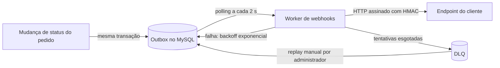

# RFC: Sistema de Webhooks de Notificação de Pedidos

| Campo | Valor |
| --- | --- |
| Autor | Larissa (Tech Lead) |
| Status | Em revisão |
| Data | Reunião técnica de quinta-feira, 09:00 (ver [`TRANSCRICAO.md`](../TRANSCRICAO.md)) |
| Revisores | Marcos (Product Manager), Bruno (Engenheiro Pleno, time de Pedidos), Diego (Engenheiro Sênior, time de Plataforma), Sofia (Engenheira de Segurança) |

## 1. Resumo (TL;DR)

Três clientes B2B querem ser avisados quando o status dos seus pedidos muda, em menos de 10 segundos. Propomos gravar cada mudança como evento numa outbox no MySQL, na mesma transação da mudança de status, e entregá-lo por um worker separado, com retentativas, assinatura HMAC e garantia at-least-once, usando só a infraestrutura e os padrões que o projeto já tem. Pedimos aos revisores que validem a abordagem e ajudem a fechar as questões da seção 5.

## 2. Contexto e problema

Atlas Comercial, MaxDistribuição e Nova Cargo pediram formalmente para ser notificados quando o status dos seus pedidos muda. Hoje eles consultam a API de pedidos de tempos em tempos, o que deixa a integração "lenta e cara" para eles. A Atlas sinalizou que pode migrar para um concorrente se não tiver a funcionalidade até o fim do trimestre ([09:00] Marcos), e pediu a entrega para o fim de novembro ([09:45] Marcos). Para os clientes, qualquer entrega abaixo de 10 segundos já é "tempo real" ([09:02] Marcos). Os webhooks são só de saída ([09:02] Marcos, [09:03] Sofia).

O ponto de disparo é a mudança de status do pedido, que acontece numa única transação: valida a transição na máquina de estados, ajusta estoque, atualiza o pedido e grava o histórico (`src/modules/orders/order.service.ts:126`). Essa transação já é pesada, e um cliente lento ou fora do ar não pode travá-la ([09:04] Bruno). Ao mesmo tempo, "Não pode ter caso de status mudar e evento não sair" ([09:40] Bruno).

## 3. Proposta técnica

### 3.1 Visão geral

A mudança de status registra um evento na própria transação. Um processo separado lê os pendentes e os entrega aos endpoints dos clientes, com retentativas por quase 15 horas; depois disso, o evento vai para uma DLQ, de onde um administrador pode reprocessá-lo.

### 3.2 Componentes e fluxo

- RFC-COMP-01 **Outbox transacional no MySQL** ([ADR-001](adrs/ADR-001-outbox-transacional-no-mysql.md)). Se a transação commita, o evento existe; se sofre rollback, some junto ([09:06] Diego). Só entra evento se algum webhook do customer assina o status ([09:34] Bruno), e o payload é gravado já montado ([09:52] Larissa).
- RFC-COMP-02 **Worker em processo separado** ([ADR-002](adrs/ADR-002-worker-em-processo-separado-com-polling.md)). Mesmo banco e mesma stack ([09:11] Diego), polling a cada 2 segundos ([09:10] Larissa); um restart da API não o derruba ([09:11] Diego).
- RFC-COMP-03 **Retry com backoff e DLQ** ([ADR-003](adrs/ADR-003-retry-com-backoff-exponencial-e-dlq.md)). 5 retentativas, de 1 minuto a 12 horas ([09:17] Larissa); depois, DLQ em tabela própria ([09:18] Diego), com replay só por administrador ([09:36] Sofia).
- RFC-COMP-04 **Autenticação HMAC-SHA256** ([ADR-004](adrs/ADR-004-autenticacao-hmac-sha256-com-secret-por-endpoint.md)). Secret única por endpoint ([09:22] Sofia), gerada pela plataforma ([09:31] Marcos) e rotacionável com carência de 24 horas ([09:21] Sofia).
- RFC-COMP-05 **Entrega at-least-once** ([ADR-005](adrs/ADR-005-entrega-at-least-once-com-x-event-id.md)). Identificador único por evento, para o cliente deduplicar ([09:25] Diego).
- RFC-COMP-06 **Módulo no padrão do projeto** ([ADR-006](adrs/ADR-006-reuso-dos-padroes-do-projeto.md)). Configuração, histórico e replay num módulo novo, com a estrutura, os erros, o logger e a validação atuais ([09:30] Larissa).

### 3.3 Garantias e limites

| ID | O cliente pode esperar | O que não é garantido |
| --- | --- | --- |
| RFC-GAR-01 | Toda mudança confirmada para um status assinado gera evento, e mudança desfeita não gera ([09:06] Diego) | Entrega exatamente uma vez ([09:24] Diego) |
| RFC-GAR-02 | Leitura do evento em até 2 segundos no pior caso ([09:10] Larissa) | Ordem global: só por pedido e com um único worker ([09:13] Larissa) |
| RFC-GAR-03 | Retentativas por quase 15 horas ([09:17] Diego) | Entrega automática depois disso: a DLQ depende de um administrador ([09:18] Diego) |
| RFC-GAR-04 | Assinatura verificável de origem e integridade ([09:19] Sofia) | Aviso proativo de falha, que ficou para uma próxima fase ([09:37] Larissa) |

## 4. Alternativas consideradas

| ID | Alternativa | Levantada em | Trade-off que levou ao descarte | Análise |
| --- | --- | --- | --- | --- |
| RFC-ALT-01 | Disparo síncrono na mudança de status | [09:03] Larissa | Um cliente lento travaria a mudança de status de outros pedidos, e um cliente fora do ar obrigaria a desfazer uma mudança legítima ([09:04] Bruno); "fora de questão" ([09:06] Diego) | [ADR-001](adrs/ADR-001-outbox-transacional-no-mysql.md) |
| RFC-ALT-02 | Fila externa (Redis Streams ou similar) | [09:07] Larissa | Exigiria subir mais infraestrutura ([09:07] Larissa); *overengineering* para um time pequeno ([09:07] Diego) | [ADR-001](adrs/ADR-001-outbox-transacional-no-mysql.md) |
| RFC-ALT-03 | Trigger no banco para acordar o worker | [09:09] Bruno | A trigger "só executa SQL", e o desvio necessário "fica esquisito" ([09:09] Diego) | [ADR-002](adrs/ADR-002-worker-em-processo-separado-com-polling.md) |
| RFC-ALT-04 | Worker dentro do processo da API | [09:11] Diego | Um restart da API derrubaria o worker ([09:11] Diego) | [ADR-002](adrs/ADR-002-worker-em-processo-separado-com-polling.md) |
| RFC-ALT-05 | Apenas 3 tentativas | [09:16] Bruno | "3 é pouco": retentaria "três vezes em 30 minutos", e um cliente já ficou duas horas fora do ar ([09:16] Diego) | [ADR-003](adrs/ADR-003-retry-com-backoff-exponencial-e-dlq.md) |
| RFC-ALT-06 | Secret global da plataforma | [09:21] Sofia | "Senão se vaza uma, vaza tudo" ([09:21] Sofia) | [ADR-004](adrs/ADR-004-autenticacao-hmac-sha256-com-secret-por-endpoint.md) |
| RFC-ALT-07 | Exactly-once | [09:25] Diego | "Garantir exactly-once exigiria coordenação dos dois lados e fica muito mais complexo" ([09:25] Diego) | [ADR-005](adrs/ADR-005-entrega-at-least-once-com-x-event-id.md) |

## 5. Questões em aberto

### 5.1 Levantadas na reunião

| ID | Questão | Origem | Situação combinada |
| --- | --- | --- | --- |
| RFC-QA-01 | Rate limiting: 50 pedidos mudando em um minuto viram 50 chamadas | [09:38] Diego | Fica como "observar e decidir depois" ([09:39] Larissa) |
| RFC-QA-02 | Escalar para vários workers, perdendo a ordem por pedido | [09:13] Bruno | É "problema do futuro, não agora" ([09:13] Diego) |
| RFC-QA-03 | Endurecer a autorização do cadastro, hoje aberto a qualquer papel autenticado | [09:36] Marcos | "Mais pra frente a gente pode endurecer." ([09:37] Sofia) |
| RFC-QA-04 | Avisar o cliente por e-mail em falhas seguidas | [09:37] Marcos | "Talvez próxima fase, depois que a gente medir o impacto" ([09:37] Larissa) |
| RFC-QA-05 | Arquivar os eventos já entregues | [09:08] Diego | "fora do escopo dessa feature" ([09:08] Diego) |

### 5.2 Identificadas na análise das ADRs

A reunião não discutiu estas lacunas. A coluna Tema na reunião indica a fala em que o assunto aparece.

| ID | Questão | Tema na reunião | ADR |
| --- | --- | --- | --- |
| RFC-QB-01 | Destino dos eventos de um webhook desativado ou removido | [09:21] Bruno | 001 |
| RFC-QB-02 | Teto de latência aceitável para o acréscimo na transação | [09:04] Bruno | 001 |
| RFC-QB-03 | Recuperação de eventos presos quando o worker cai | [09:11] Diego | 002 |
| RFC-QB-04 | Monitoramento de que o worker está vivo | [09:11] Diego | 002 |
| RFC-QB-05 | Ordem por pedido com um evento anterior em retentativa | [09:13] Larissa | 002 |
| RFC-QB-06 | Quais respostas HTTP, além do timeout, contam como falha | [09:42] Diego | 003 |
| RFC-QB-07 | Auditoria do replay só em log ou também persistida | [09:36] Sofia | 003 |
| RFC-QB-08 | Se o replay mantém o identificador original | [09:18] Diego | 003, 005 |
| RFC-QB-09 | Como assinar nas 24 horas com duas secrets válidas | [09:21] Sofia | 004 |
| RFC-QB-10 | Timestamp de envio fora da assinatura | [09:44] Diego | 004 |
| RFC-QB-11 | Proteção da secret em repouso | [09:21] Bruno | 004 |
| RFC-QB-12 | Mesmo identificador para dois webhooks do mesmo customer | [09:25] Diego | 005 |
| RFC-QB-13 | Validação de URL no schema gera erro genérico, não o código do módulo | [09:23] Sofia | 006 |
| RFC-QB-14 | Criação do pedido grava o status inicial fora da mudança de status (`src/modules/orders/order.service.ts:58`) | Não discutido | Código |

## 6. Impacto e riscos

### 6.1 Impacto no sistema existente

- RFC-IMP-01 **Pedidos:** a transação de mudança de status passa a inserir o evento na outbox ([09:40] Bruno), a única alteração num módulo existente.
- RFC-IMP-02 **Processos:** o sistema, hoje com um único processo HTTP (`src/server.ts:6`), ganha um segundo processo ([09:11] Diego).
- RFC-IMP-03 **Banco:** outbox, DLQ, configuração e histórico de entregas no MySQL atual ([09:07] Diego, [09:34] Marcos).
- RFC-IMP-04 **API:** um módulo novo, composto como os demais (`src/app.ts:26`), sem mudar o error middleware nem o logger ([09:29] Bruno).

### 6.2 Riscos

| ID | Risco | Impacto | Mitigação | Fonte |
| --- | --- | --- | --- | --- |
| RFC-RISCO-01 | A transação, já pesada, fica mais lenta | Latência maior em toda mudança de status | Só grava evento quando algum webhook assina o status ([09:34] Bruno) | [09:04] Bruno |
| RFC-RISCO-02 | Um cliente não deduplica os eventos | O mesmo evento processado duas vezes do lado dele | Documentação em destaque no portal ([09:26] Marcos) | [09:25] Sofia |
| RFC-RISCO-03 | Uma secret vaza | Terceiros forjam envios para aquele endpoint | Secret por endpoint, rotação com carência ([09:21] Sofia) e revisão de segurança ([09:46] Sofia) | [09:22] Diego |
| RFC-RISCO-04 | Autorização frouxa: qualquer usuário autenticado gerencia webhooks de qualquer customer, e o registro público aceita o papel de administrador | Acesso indevido à configuração e ao replay | Replay restrito a administradores ([09:36] Larissa); detalhe no FDD e no PRD | [09:37] Sofia, `src/modules/auth/auth.schemas.ts:7` |
| RFC-RISCO-05 | O prazo da Atlas não é cumprido | Risco de perder o cliente | Confirmação do prazo com a Atlas ([09:47] Marcos) | [09:00] Marcos |

### 6.3 Esforço e dependências

A estimativa é de três sprints, com a revisão de segurança incluída no fim ([09:47] Larissa): uma sprint para outbox e DLQ, uma para worker e retry, meia para configuração e histórico e meia para a integração com pedidos e os testes ponta a ponta ([09:46] Larissa).

- RFC-DEP-01 Dois dias úteis de revisão de segurança da Sofia antes do deploy ([09:46] Sofia).
- RFC-DEP-02 Documentação no portal do desenvolvedor, com o Marcos ([09:40] Marcos).
- RFC-DEP-03 Confirmação do prazo com a Atlas, com o Marcos ([09:47] Marcos).

## 7. Decisões relacionadas

- [ADR-001: Outbox transacional no MySQL existente](adrs/ADR-001-outbox-transacional-no-mysql.md)
- [ADR-002: Worker em processo separado com polling](adrs/ADR-002-worker-em-processo-separado-com-polling.md)
- [ADR-003: Retry com backoff exponencial e DLQ em tabela separada](adrs/ADR-003-retry-com-backoff-exponencial-e-dlq.md)
- [ADR-004: Autenticação HMAC-SHA256 com secret por endpoint e rotação](adrs/ADR-004-autenticacao-hmac-sha256-com-secret-por-endpoint.md)
- [ADR-005: Entrega at-least-once com X-Event-Id para deduplicação](adrs/ADR-005-entrega-at-least-once-com-x-event-id.md)
- [ADR-006: Reuso dos padrões existentes do projeto](adrs/ADR-006-reuso-dos-padroes-do-projeto.md)
