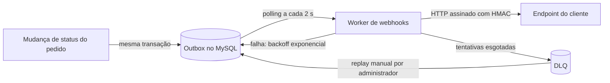

# RFC: Sistema de Webhooks de Notificação de Pedidos

| Campo | Valor |
| --- | --- |
| Autor | Larissa (Tech Lead) |
| Status | Em revisão |
| Data | Reunião técnica de quinta-feira, 09:00 (ver [`TRANSCRICAO.md`](../TRANSCRICAO.md)) |
| Revisores | Marcos (Product Manager), Bruno (Engenheiro Pleno, time de Pedidos), Diego (Engenheiro Sênior, time de Plataforma), Sofia (Engenheira de Segurança) |

## 1. Resumo (TL;DR)

Três clientes B2B querem ser avisados quando o status dos seus pedidos muda, em menos de 10 segundos. Propomos gravar cada mudança como evento numa outbox no MySQL, na mesma transação da mudança de status, e entregar esses eventos por um worker separado, com retentativas, assinatura HMAC e garantia at-least-once. A proposta usa só a infraestrutura e os padrões que o projeto já tem. Pedimos aos revisores que validem a abordagem e ajudem a fechar as questões em aberto da seção 5.

## 2. Contexto e problema

Atlas Comercial, MaxDistribuição e Nova Cargo pediram formalmente para ser notificados quando o status dos seus pedidos muda. Hoje eles consultam a API de pedidos de tempos em tempos, o que deixa a integração "lenta e cara" para eles. A Atlas sinalizou que pode migrar para um concorrente se não tiver a funcionalidade até o fim do trimestre ([09:00] Marcos), e pediu a entrega para o fim de novembro ([09:45] Marcos). Para os clientes, qualquer entrega abaixo de 10 segundos já é "tempo real" ([09:02] Marcos). Os webhooks são só de saída: os clientes querem receber, não enviar ([09:02] Marcos, [09:03] Sofia).

O ponto de disparo natural é a mudança de status do pedido. No código, ela acontece numa única transação que valida a transição na máquina de estados, ajusta estoque, atualiza o pedido e grava o histórico de status (`src/modules/orders/order.service.ts:126`). Essa transação já é considerada pesada ([09:04] Bruno). O desafio é notificar sistemas externos, que podem estar lentos ou fora do ar, sem travar essa transação e sem perder nenhuma mudança: "Não pode ter caso de status mudar e evento não sair" ([09:40] Bruno).

## 3. Proposta técnica

### 3.1 Visão geral

A mudança de status passa a registrar um evento dentro da própria transação. Um processo separado lê os eventos pendentes e os entrega aos endpoints cadastrados pelos clientes. Falhas são retentadas por até cerca de 15 horas. Depois disso, o evento vai para uma fila de mensagens mortas (DLQ), de onde um administrador pode reprocessá-lo.

### 3.2 Componentes e fluxo

- **Outbox transacional no MySQL.** O evento é gravado na mesma transação da mudança de status: se ela commita o evento existe, e se sofre rollback o evento some junto. Só entra evento se algum webhook do customer assina aquele status, e o payload é gravado já montado, como retrato do pedido naquele momento. Decisão em [ADR-001](adrs/ADR-001-outbox-transacional-no-mysql.md).
- **Worker em processo separado.** Um segundo processo, com o mesmo banco e a mesma stack, consulta a outbox a cada 2 segundos e faz as chamadas HTTP. Deploys e restarts da API não interrompem as entregas. Decisão em [ADR-002](adrs/ADR-002-worker-em-processo-separado-com-polling.md).
- **Retry com backoff e DLQ.** Uma entrega com falha é retentada 5 vezes, com intervalos de 1 minuto a 12 horas. Esgotadas as tentativas, o evento vai para uma DLQ em tabela própria, e só um administrador pode devolvê-lo à outbox. Decisão em [ADR-003](adrs/ADR-003-retry-com-backoff-exponencial-e-dlq.md).
- **Autenticação HMAC-SHA256.** Cada envio é assinado com uma secret única por endpoint, gerada pela plataforma e rotacionável com carência de 24 horas. Decisão em [ADR-004](adrs/ADR-004-autenticacao-hmac-sha256-com-secret-por-endpoint.md).
- **Entrega at-least-once.** Cada evento carrega um identificador único para que o cliente descarte repetições. Decisão em [ADR-005](adrs/ADR-005-entrega-at-least-once-com-x-event-id.md).
- **Módulo no padrão do projeto.** A configuração dos webhooks, o histórico de entregas e o reprocessamento vivem num módulo novo, com a mesma estrutura, classes de erro, logger e validação dos módulos atuais. Decisão em [ADR-006](adrs/ADR-006-reuso-dos-padroes-do-projeto.md).

### 3.3 Garantias e limites

| O cliente pode esperar | O que não é garantido |
| --- | --- |
| Toda mudança de status confirmada gera um evento, e nenhuma mudança desfeita gera | Entrega exatamente uma vez: o mesmo evento pode chegar mais de uma vez |
| Leitura do evento em até cerca de 2 segundos após a mudança ([09:10] Larissa) | Ordem global entre pedidos: a ordem vale por pedido e enquanto houver um único worker ([09:13] Larissa) |
| Retentativas por até cerca de 15 horas antes de desistir ([09:17] Diego) | Entrega automática depois disso: o evento na DLQ depende de ação de um administrador |
| Assinatura verificável da origem e da integridade de cada envio ([09:19] Sofia) | Aviso proativo quando as entregas falham, que ficou para uma próxima fase ([09:37] Larissa) |

## 4. Alternativas consideradas

| Alternativa | Levantada em | Trade-off que levou ao descarte | Análise |
| --- | --- | --- | --- |
| Disparo síncrono na mudança de status | [09:03] Larissa | Um cliente lento travaria a mudança de status de outros pedidos, e um cliente fora do ar obrigaria a desfazer uma mudança legítima ([09:04] Bruno). Descartado como "fora de questão" ([09:06] Diego). | [ADR-001](adrs/ADR-001-outbox-transacional-no-mysql.md) |
| Fila externa (Redis Streams ou similar) | [09:07] Larissa | Seria reativa, mas exigiria subir infraestrutura nova ([09:07] Larissa), o que é *overengineering* para um time pequeno ([09:07] Diego). | [ADR-001](adrs/ADR-001-outbox-transacional-no-mysql.md) |
| Trigger no banco para acordar o worker | [09:09] Bruno | O MySQL não notifica processo externo; a trigger "só executa SQL", e o desvio necessário "fica esquisito" ([09:09] Diego). | [ADR-002](adrs/ADR-002-worker-em-processo-separado-com-polling.md) |
| Worker dentro do processo da API | [09:11] Diego | Um restart da API derrubaria o worker junto ([09:11] Diego). | [ADR-002](adrs/ADR-002-worker-em-processo-separado-com-polling.md) |
| Apenas 3 tentativas | [09:16] Bruno | Seria mais agressivo, mas "3 é pouco": cobriria só cerca de 30 minutos, e um cliente já ficou duas horas fora do ar em manutenção planejada ([09:16] Diego). | [ADR-003](adrs/ADR-003-retry-com-backoff-exponencial-e-dlq.md) |
| Secret global da plataforma | [09:21] Sofia | Uma secret só seria mais simples de gerenciar, mas "se vaza uma, vaza tudo" ([09:21] Sofia). | [ADR-004](adrs/ADR-004-autenticacao-hmac-sha256-com-secret-por-endpoint.md) |
| Exactly-once | [09:25] Diego | Eliminaria repetições, mas "exigiria coordenação dos dois lados e fica muito mais complexo" ([09:25] Diego). | [ADR-005](adrs/ADR-005-entrega-at-least-once-com-x-event-id.md) |

## 5. Questões em aberto

### 5.1 Levantadas na reunião

| Questão | Origem | Situação combinada |
| --- | --- | --- |
| Rate limiting de envio: um cliente com 50 pedidos mudando em um minuto recebe 50 chamadas | [09:38] Diego | Fica como "observar e decidir depois" ([09:39] Larissa); implementar "se virar problema" ([09:39] Diego) |
| Escalar para vários workers, perdendo a ordem por pedido | [09:13] Bruno | É "problema do futuro, não agora", com particionamento por pedido ou lock como caminhos ([09:13] Diego) |
| Endurecer a autorização do cadastro de webhooks, hoje aberto a qualquer papel autenticado | [09:36] Marcos | "Por enquanto sim. Mais pra frente a gente pode endurecer." ([09:37] Sofia) |
| Avisar o cliente por e-mail quando as entregas falham seguidamente | [09:37] Marcos | Fora desta fase: "Talvez próxima fase, depois que a gente medir o impacto" ([09:37] Larissa) |
| Arquivar os eventos já entregues | [09:08] Diego | Cerca de 30 dias, mas "fora do escopo dessa feature" ([09:08] Diego) |

### 5.2 Identificadas na análise das ADRs

Estas lacunas não foram discutidas na reunião. Surgiram ao formalizar as decisões e precisam de resposta antes ou durante a implementação.

| Questão | Origem |
| --- | --- |
| O que acontece com os eventos já gravados quando o webhook é desativado ou removido | [ADR-001](adrs/ADR-001-outbox-transacional-no-mysql.md) |
| Qual o teto de latência aceitável para o acréscimo na transação de mudança de status | [ADR-001](adrs/ADR-001-outbox-transacional-no-mysql.md) |
| Como recuperar eventos presos em processamento quando o worker cai | [ADR-002](adrs/ADR-002-worker-em-processo-separado-com-polling.md) |
| Como monitorar que o worker está vivo | [ADR-002](adrs/ADR-002-worker-em-processo-separado-com-polling.md) |
| Como fica a ordem por pedido quando um evento anterior está em retentativa | [ADR-002](adrs/ADR-002-worker-em-processo-separado-com-polling.md) |
| Quais respostas HTTP, além da falta de resposta, contam como falha | [ADR-003](adrs/ADR-003-retry-com-backoff-exponencial-e-dlq.md) |
| Se a auditoria do reprocessamento fica só em log ou também persistida | [ADR-003](adrs/ADR-003-retry-com-backoff-exponencial-e-dlq.md) |
| Se o reprocessamento mantém o identificador original do evento | [ADR-003](adrs/ADR-003-retry-com-backoff-exponencial-e-dlq.md), [ADR-005](adrs/ADR-005-entrega-at-least-once-com-x-event-id.md) |
| Como assinar durante as 24 horas em que duas secrets são válidas | [ADR-004](adrs/ADR-004-autenticacao-hmac-sha256-com-secret-por-endpoint.md) |
| O timestamp de envio vai em header, mas fica fora da assinatura | [ADR-004](adrs/ADR-004-autenticacao-hmac-sha256-com-secret-por-endpoint.md) |
| Como a secret é protegida em repouso | [ADR-004](adrs/ADR-004-autenticacao-hmac-sha256-com-secret-por-endpoint.md) |
| Se um evento enviado a dois webhooks do mesmo customer usa o mesmo identificador | [ADR-005](adrs/ADR-005-entrega-at-least-once-com-x-event-id.md) |
| A validação de URL no schema gera o erro genérico de validação, e não o código próprio do módulo | [ADR-006](adrs/ADR-006-reuso-dos-padroes-do-projeto.md) |
| A criação do pedido grava o status inicial fora da mudança de status (`src/modules/orders/order.service.ts:58`); não está definido se isso gera evento | Mapeamento do código |

## 6. Impacto e riscos

### 6.1 Impacto no sistema existente

- **Pedidos.** A transação de mudança de status passa a consultar as assinaturas do customer e a gravar o evento ([09:40] Bruno). É a única alteração num módulo existente.
- **Processos.** O sistema, hoje com um único processo HTTP (`src/server.ts:6`), ganha um segundo processo para implantar e operar ([09:11] Diego).
- **Banco.** Entram as estruturas da outbox, da DLQ, da configuração de webhooks e do histórico de entregas, todas no MySQL atual ([09:07] Diego, [09:34] Marcos).
- **API.** Entra um módulo novo, composto como os demais (`src/app.ts:26`), sem mudar o error middleware nem o logger ([09:29] Bruno).

### 6.2 Riscos

| Risco | Impacto | Mitigação | Fonte |
| --- | --- | --- | --- |
| A transação de mudança de status, já pesada, fica mais lenta | Latência maior em toda mudança de status | Só grava evento quando algum webhook assina o status ([09:34] Bruno); o teto aceitável está em aberto (5.2) | [09:04] Bruno, [ADR-001](adrs/ADR-001-outbox-transacional-no-mysql.md) |
| O worker de instância única para ou fica lento | Entregas atrasam para todos os clientes | Os eventos acumulam na outbox sem se perder; o monitoramento está em aberto (5.2) | [ADR-002](adrs/ADR-002-worker-em-processo-separado-com-polling.md) |
| Um cliente não deduplica os eventos | O mesmo pedido é processado duas vezes do lado dele | Documentação em destaque no portal do desenvolvedor ([09:26] Marcos) | [09:25] Sofia |
| Uma secret vaza | Terceiros forjam envios para aquele endpoint | Secret por endpoint, rotação com carência ([09:21] Sofia) e revisão de segurança antes do deploy ([09:46] Sofia); o logger atual não mascara secrets (`src/shared/logger/index.ts:4`) | [09:22] Diego |
| O modelo de autorização é frouxo: qualquer usuário autenticado gerencia webhooks de qualquer customer, e o registro público aceita o papel de administrador | Acesso indevido à configuração e ao reprocessamento | Reprocessamento restrito a administradores ([09:36] Larissa); o tratamento detalhado fica no FDD e no PRD | [09:37] Sofia, `src/modules/auth/auth.schemas.ts:7` |
| O prazo pedido pela Atlas não é cumprido | Risco de perder o cliente | Escopo enxuto: e-mail, painel e rate limiting fora desta fase ([09:48] Larissa) | [09:00] Marcos, [09:45] Marcos |

### 6.3 Esforço e dependências

A estimativa é de três sprints, com a revisão de segurança incluída no fim ([09:47] Larissa). A divisão é de uma sprint para a modelagem da outbox e da DLQ, uma para o worker e o retry, meia para a configuração e o histórico de entregas e meia para a integração com pedidos e os testes de ponta a ponta ([09:46] Larissa).

A entrega depende de:
- Dois dias úteis de revisão de segurança da Sofia antes do deploy ([09:46] Sofia).
- Documentação no portal do desenvolvedor, a cargo do Marcos ([09:40] Marcos).
- Confirmação do prazo com a Atlas, também a cargo do Marcos ([09:47] Marcos).

## 7. Decisões relacionadas

- [ADR-001: Outbox transacional no MySQL existente](adrs/ADR-001-outbox-transacional-no-mysql.md): o evento nasce na mesma transação da mudança de status.
- [ADR-002: Worker em processo separado com polling](adrs/ADR-002-worker-em-processo-separado-com-polling.md): um processo próprio entrega os eventos, consultando a outbox a cada 2 segundos.
- [ADR-003: Retry com backoff exponencial e DLQ em tabela separada](adrs/ADR-003-retry-com-backoff-exponencial-e-dlq.md): 5 retentativas ao longo de cerca de 15 horas, depois DLQ com reprocessamento manual.
- [ADR-004: Autenticação HMAC-SHA256 com secret por endpoint e rotação](adrs/ADR-004-autenticacao-hmac-sha256-com-secret-por-endpoint.md): cada envio é assinado com uma secret exclusiva do endpoint.
- [ADR-005: Entrega at-least-once com X-Event-Id para deduplicação](adrs/ADR-005-entrega-at-least-once-com-x-event-id.md): o cliente pode receber repetições e as descarta pelo identificador do evento.
- [ADR-006: Reuso dos padrões existentes do projeto](adrs/ADR-006-reuso-dos-padroes-do-projeto.md): o módulo segue a estrutura, os erros, o logger e a validação que o projeto já usa.
